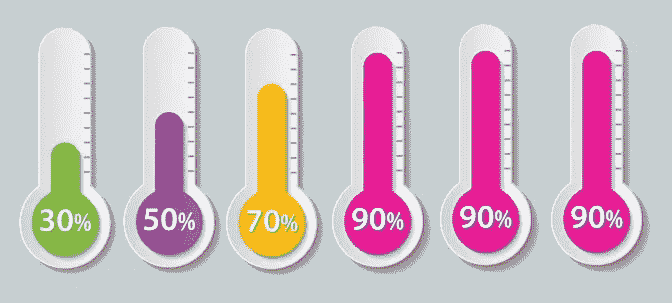

# 为什么软件总是九成做好？

> 原文：<https://medium.com/swlh/why-is-software-always-ninety-percent-done-38e125c8b35c>

## 这是信息技术最大的谜团之一。

Graphic by Author

"嘿，菲尔，你那个子系统怎么样了？"

“挺好的。我大约完成了 90%。”

“哦。几周前你不是已经完成了 90%吗？”