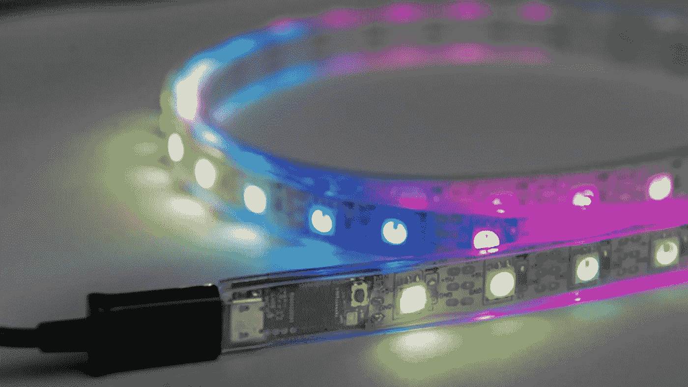

# 为什么你的管道会发光？

> 原文：<https://medium.com/swlh/why-is-your-pipeline-glowing-c3b24c6a93d9>

> **CI/CD** 或 **CICD** 是指[持续整合](https://en.wikipedia.org/wiki/Continuous_integration)和[持续交付](https://en.wikipedia.org/wiki/Continuous_delivery)和/或[持续部署](https://en.wikipedia.org/wiki/Continuous_deployment)的组合做法。

大多数开发人员从一个简单的 Hello-World 示例开始学习编码，这个示例基本上显示单词“Hello World！”在某种显示器或平台上。闪烁的 LED 一直是“Hello World！”因此，工程师们总是情有独钟…