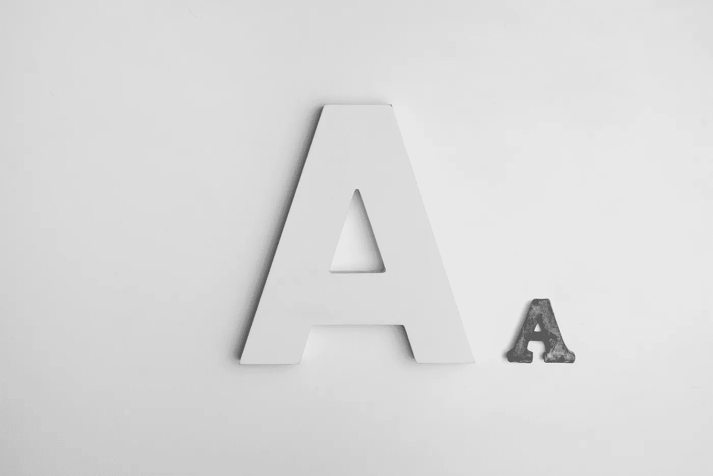

# 为什么少即是多

> 原文：<https://medium.com/swlh/why-less-is-more-d6e2854bbdbe>

## 你只有一个首要任务

Photo by Alexander Andrews via Unsplash

你可能听说过少即是多。

我们是一个把收集杂物当成天职的民族。当我们用光了空间，厌倦了周围所有的东西时，我们呼吁善意把它从我们手中拿走。

# 这就是极简主义吸引人的原因。