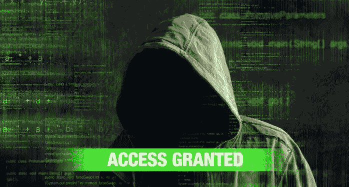

# 为什么让我们加密是一个非常，非常，非常糟糕的主意…

> 原文：<https://medium.com/swlh/why-lets-encrypt-is-a-really-really-really-bad-idea-d69308887801>

## 我说过这是个很糟糕的主意吗？？？

**更新**:当你读完这篇文章后，请务必阅读[我对众多批评者的回应](/swlh/why-lets-encrypt-is-a-really-bad-idea-part-ii-b05944c1c501)。这也激起了[的精彩回应](/swlh/https-medium-com-swlh-lets-encrypt-securing-the-web-for-all-5b50842ecead)。反过来，[我解释了一个扩展值 SSL/TLS 证书的价值](/swlh/what-is-the-value-of-an-extended-validation-ev-ssl-certificate-43f61edf53f3)。