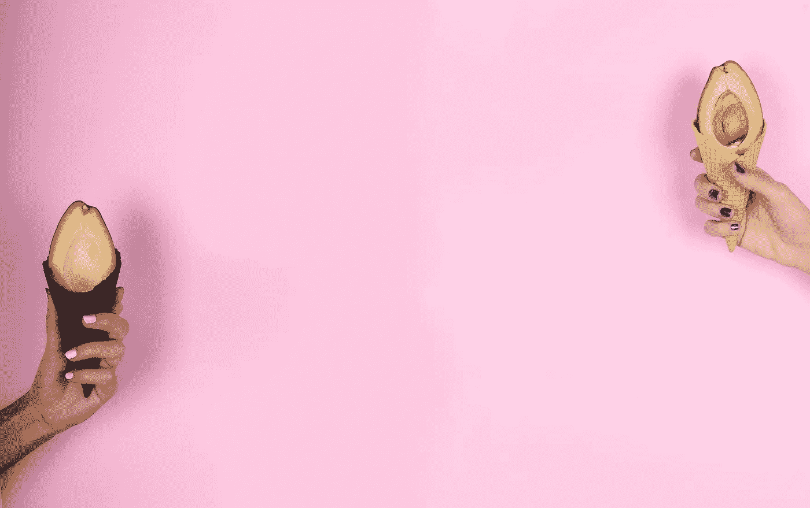

# 为什么“千禧营销”是一个神话

> 原文：<https://medium.com/swlh/why-millennial-marketing-is-a-myth-725e043d3520>

Photo by [Katarina Šikuljak](https://unsplash.com/photos/BeEnOzyIBsU?utm_source=unsplash&utm_medium=referral&utm_content=creditCopyText) on [Unsplash](https://unsplash.com/search/photos/avocado?utm_source=unsplash&utm_medium=referral&utm_content=creditCopyText)

严格来说我是千禧一代。35 岁的时候，我认为自己太老了，但显然不是——这取决于你选择哪一个分界点。

然而，我不属于千禧一代被归入的那一类人。

我不吃鳄梨吐司。我其实一点也不喜欢鳄梨。