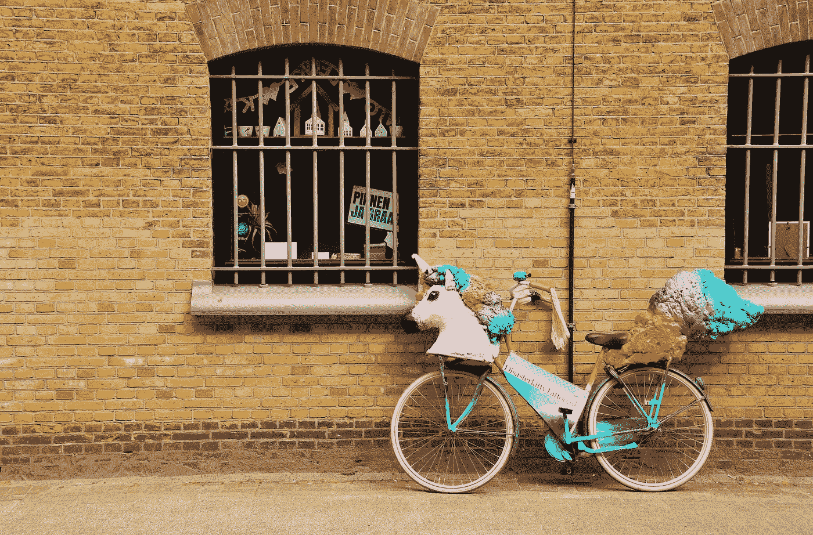

# 为什么动力不够(以及如何贯彻你的新年决心)

> 原文：<https://medium.com/swlh/why-motivation-isnt-enough-and-how-to-follow-through-on-your-new-year-resolutions-19025724a3c3>

Motivation is whimsical. Photo by [Boudewijn Huysmans](https://unsplash.com/photos/HtBuc5Ku-tI?utm_source=unsplash&utm_medium=referral&utm_content=creditCopyText) on [Unsplash](https://unsplash.com/?utm_source=unsplash&utm_medium=referral&utm_content=creditCopyText)

## **让我们今年不要犯同样的错误**

在圣诞节和新年庆祝活动中，我们一直在吃喝。现在该醒醒酒迎接新的一年了。

我们决心重新开始。让这一年有意义。有史以来最好的一年。