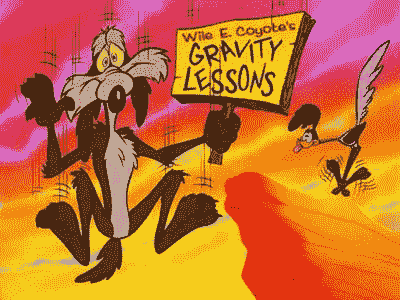

# 为什么乐观是企业家最大的敌人

> 原文：<https://medium.com/swlh/why-optimism-is-an-entrepreneurs-worst-enemy-f31f26ce710d>

在你的生活、人际关系和职业生涯中，你可能有一套重复出现的模式。我当然知道:

1.  我和和我爸爸很像的人约会。
2.  我先给建议，才知道朋友要建议。
3.  谈到创业、融资和增长，我倾向于假设最好的情况。