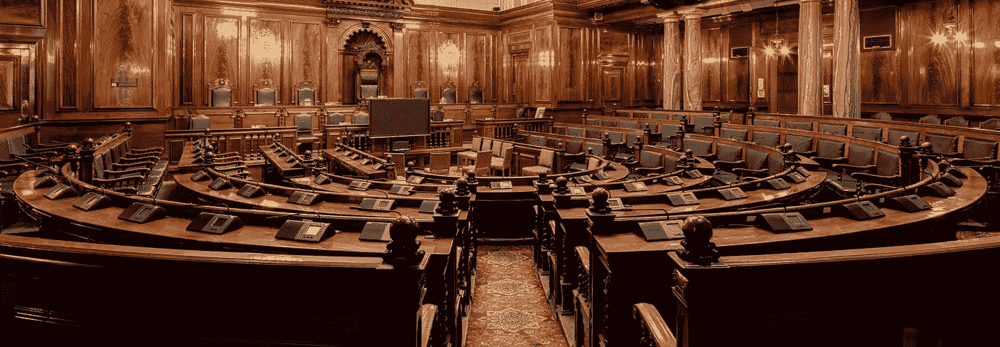

# 为什么政客是濒临灭绝的物种

> 原文：<https://medium.com/swlh/why-politicians-are-a-dying-breed-a893571bf2ed>

A soon to be obsolete hall of governance. Photo [cropped] by [Michael D Beckwith](https://unsplash.com/photos/5C58vkFXdYs?utm_source=unsplash&utm_medium=referral&utm_content=creditCopyText) on [Unsplash](https://unsplash.com/search/photos/politicians?utm_source=unsplash&utm_medium=referral&utm_content=creditCopyText).

## 自动化、人工智能和密码正在让政治变得过时

## 随着 2020 年的临近，典型的美国总统竞选将耗资数亿美元，你可能会认为成为一名政治家比以往任何时候都更酷。事实上，多亏了科技…