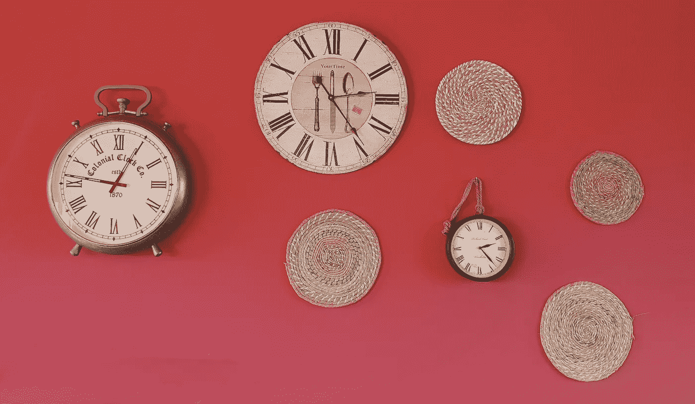

# 为什么拖延很糟糕，你能做些什么

> 原文：<https://medium.com/swlh/why-procrastination-sucks-and-what-you-can-do-about-it-856dd03881df>

Photo by [Karim MANJRA](https://unsplash.com/@karim_manjra?utm_source=unsplash&utm_medium=referral&utm_content=creditCopyText) on [Unsplash](https://unsplash.com/search/photos/procrastination?utm_source=unsplash&utm_medium=referral&utm_content=creditCopyText)

拖延是自我破坏的一种形式:根据被拖延的任务的严重性或破坏性后果，它可能会引发内疚、压力甚至自我憎恨的感觉。但是拖延症总是坏事吗？如果是这样的话:你怎样才能把做这件事的风险降到最低？让我们来看看: