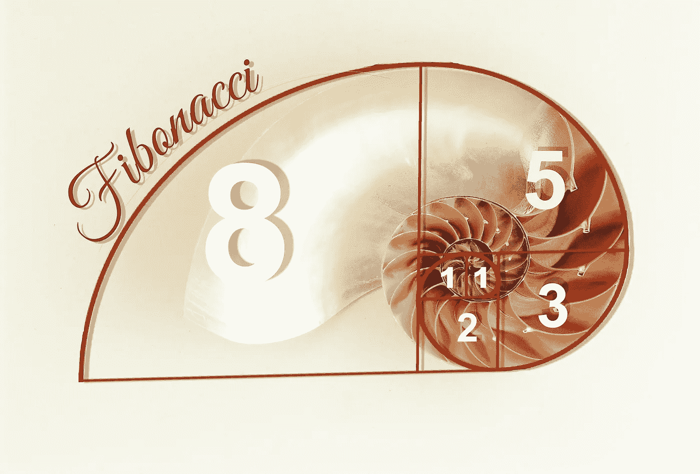

# 为什么程序员需要创造力

> 原文：<https://medium.com/swlh/why-programmers-need-creativity-982a38d345c8>

Image by [Karin Henseler,](https://pixabay.com/users/sciencefreak-97947/) Pixabay

我的一个技术朋友在 2 年前将他的软件职业从手工测试转向了大数据。一切都很好:工资涨了两倍，由于股票期权的快速流动性，抵押贷款变得宽松了。

但是奶油上的樱桃是非常解放的工作文化——与他以前工作的血汗工厂相比。