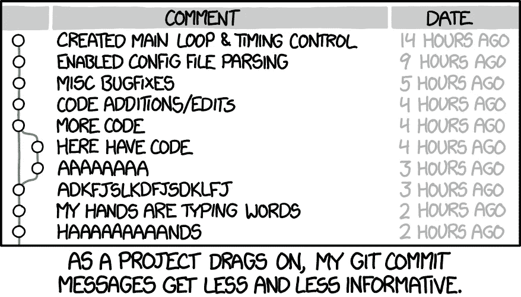

# 为什么我应该编写好的提交消息？

> 原文：<https://medium.com/swlh/why-should-i-write-good-commit-messages-e15d37bf45cb>



[https://xkcd.com/1296/](https://xkcd.com/1296/)

作为一名应届毕业生，为一个被数百万用户使用的产品编写代码的前景让我兴奋不已。我迫不及待地发送我的第一次公关，并得到它合并。我一点也不知道，我收到的第一条评论不是关于我的代码，而是关于我的提交消息，以及它们需要如何改进。

年轻的我想，“为什么这很重要？谁在乎消息？重要的是代码。”两年后，在参与了多个项目、审阅了无数的 pr 和查看了过多的公共软件包后，我意识到我是多么的错误。在本文中，我将描述各种场景，这些场景让我体会到编写好的提交消息的重要性。

有很多好文章和博客([在这里](https://chris.beams.io/posts/git-commit/))都是关于如何写提交消息，并列出该做和不该做的事情。在这里，我的重点是**为什么**你应该这样做。

# **1。生产问题**

> 老软件工程师汤姆

*星期六，凌晨 2 点 31 分——电话铃响了。*

汤姆接了电话，发现付费用户无法登录，什么也做不了。一股寒气涌上他的脊梁。在他内心深处，他知道他不应该在星期五部署。然而，他做到了，就在那里。

他打开笔记本电脑，检查服务器警报— *服务器错误增多*。为了找出造成这种情况的原因，他打开了服务器错误日志并找到了答案

```
**TypeError**: Cannot read property “id” of undefined**25:13** /api/controllers/LoginController.js
**192:17** …
```

“啊哈！”他大声说道。他释放了他选择的武器——git。

```
$ git blame api/controllers/LoginController.js
```

这就是了

```
...
**f4f78b31** 25) if (user.team.id > 1)
**f4f78b31** 26)     return teamLogin();
**f4f78b31** 26) else
**f4f78b31** 27)     return userLogin();
...
```

窃听器就在那里。对属性`id`的不安全访问。如果用户不属于某个团队，该怎么办？`team`属性将不存在。因此所有非团队用户都不能登录。

要解决这个问题，只需用`user.team && user.team.id`替换*线 25* 。轻松点。对吗？

没那么快。ID 为 1 的团队呢？为什么团队登录和用户登录不一样？为什么要做出这样的改变？团队 ID `0`可能吗？为了更好地理解这个问题，汤姆决定进一步挖掘。

```
$ git show **f4f78b31**commit f4f78b319c308600eab015a5d6529add21660dc1
Author: Jerry
Date: Fri Mar 13 10:12:29 2019 +0330 **update login flow** <- 😩😩😩😩...
```

问题就在这里——提交消息含糊不清，除了实际的代码差异之外，它没有告诉 Tom 更多的信息。他已经知道登录流被更新了。他正在寻找更多信息来*帮助他理解*代码变更。更好的提交消息可能是:

```
Create a new login page for team usersWe want to capture team names in the login flow for paid users. This commit shows the new login page for users with a valid team ID.
```

这个提交消息传达了更多关于*为什么*做出改变的信息？汤姆也知道这个变化是针对谁的。这一点，结合行内评论，将有助于他做出更明智的决定。

# 2.了解原因

> 卡尔文，实习生

星期一，上午 8 点 36 分

Calvin 被分配了一个类似 aps 的项目的入门问题。他的任务是为杂货店添加一个配置。他要利用这个机会熟悉代码库。

他从`README.md`和`IMPLEMENTATION.md`文件开始了解项目概况。挖了一会儿后，他发现这些变化是在`config/maps/elements.js`对我做的。他必须为键`grocery-store`添加一个 JSON 配置。有趣的是，他看到了这段代码

```
if (type === 'hospital' || type === 'pharmacy') {
    config = getConfigFromAPI();
}
```

“为什么对医院和药店有特殊处理？我需要为杂货店增加特殊处理吗？”，他认为。他查看提交消息。

```
commit f4f78b319c308600eab015a5d6529add21660dc1
Author: Hobbes
Date: Fri Mar 11 10:10:21 2018 +0530**add safe checks in element config** <- 🤔...
```

虽然这个消息告诉你这个条件是安全的，但是它仍然没有给你完整的描述。像上一节一样，它没有告诉你*为什么*做出了改变。更好的提交消息可能是

```
fetch map element config from API for emergency buildings to avoid stale information
```

这清楚地传达了代码更改的目的，并为读者做出决定提供了足够的信息。卡尔文可以推断出，特殊处理只适用于紧急建筑，杂货店不需要。

在这里，一个好的提交消息可以帮助一个新开发人员理解部分代码库，而不需要任何人的帮助。在这方面，提交消息是代码文档的第二个字符串。

# 3.审查代码

> 威尔玛，项目负责人

*星期五，下午 3 点 04 分*

Fred 要求 Wilma 对团队管理视图中的重大变更进行代码审查。威尔玛拉动机器上的分支，测试这些变化——它们似乎在工作。她首先检查分支(`feature/admin-updates`)和`develop`(目的地)之间的差异统计。

```
$ git diff feature/admin-updates develop --stats...**45 files changed, 4085 insertions(+), 590 deletions(-)** <- **😱**
```

差异显示了许多代码变化，包括一堆新的后端 API、实用程序、数据流变化和 UI 变化。她查看提交日志，以确定所有这些更改是否组织得当。

```
$ git log --oneline develop..feature/admin-updatescommit f4f78b319c308600eab015a5d6529add21660dc1
Author: Fred
Date: Fri Jun 11 2018 12:35:23 +0000admin view updates                     <- 😑😑😑
```

威尔玛留下以下评论:

```
The changes you made seem to be working fine based on a cursory test. However, there are way too many code changes (~4000 lines) in a single commit. This makes it very difficult to review. It might also cause certain issues to be overlooked just by the sheer size of it.You can (and should) split your code into logically independent commits. Example -- add API endpoints and tests for billing changes in admin view
- add utilities to validate billing roles for a user
- separate billing and team management sections in team settings
- update UI in team settings view to be design system 3.2 compliant
```

请注意，重点是将一个大的变更分解成更小的块，由适当的提交消息标识。这允许更有效的代码审查，并减少忽略错误的机会。

通过向较小的提交提供适当的信息，您向评审者传达了您对解决方案的心理模型。这减少了摩擦，并确保开发人员和评审人员在同一页上。

# 4.变更日志

> 达芙妮，工程经理

昨天发布了一个错误修复版本(`4.1.1`)。Daphne 想知道修复了哪些 bug，做了哪些计划外的代码更改。她拉出最新的`master`并运行以下命令

```
$ git log --oneline v4.1.0..v4.1.1**c1c29526** Upgrade version to v4.1.1
**e7f05736** Fix issue #342               <- #342 of which project?
**e8ad9e21** address comments             <- What comments?
**e3d84047** fix lint tests               <- Where? What for?
**fc6b65de** login button bugfix          <- What was the bug?
```

这些提交消息几乎没有传达版本中的内容。它们表示登录错误已修复，问题#342 已解决。但是这些问题是什么，又是如何解决的呢？

还有，也有像`address comments`和`fix lint tests`这样的流浪犯。这些提交不是独立的，并且不提供任何附加值。相反，它们应该被它们正在修改的提交压扁。

下面显示了详细提交消息的一个变体，这将有助于 Daphne 更好地理解版本中的更改

```
**e1b29221** Upgrade version to v4.1.1 **e8ad9e33** [GH-342] Fixed issue where header image was not visible in Safari and Internet Explorer
**ac6b15ae** Fixed an issue where login button was disabled for users on the enterprise plan
   - added e2e tests for this flow
   - added analytics events for login failure
```

这些消息清楚地解释了这些变化，也去掉了不必要的消息。任何经历过这一过程的人都可以很容易地了解特定版本中的变化。这在开发公共包时非常方便——您的消费者确切地知道发生了什么变化。

随着时间的推移，我开始将提交消息视为与我的代码相关联的小便笺，它为读者提供了非常需要的上下文。下一次他们看到我的代码并尖叫“为什么？”，不敢相信，希望我的 commit 消息能安抚他们。