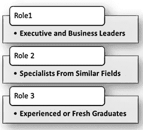

# 为什么要像疯子一样学习人工智能？

> 原文：<https://medium.com/swlh/why-should-you-learn-artificial-intelligence-like-a-maniac-70e77d835226>

Photo by [Kyle Loftus](https://unsplash.com/photos/NWPnWhaCtTg?utm_source=unsplash&utm_medium=referral&utm_content=creditCopyText) on [Unsplash](https://unsplash.com/search/photos/crazy?utm_source=unsplash&utm_medium=referral&utm_content=creditCopyText)

看起来好像每天都有新的故事警告我们，人工智能将取代我们的工作，或者人工智能将改变人类的面貌。如果你想成为这种彻底转变的一部分，你不需要等待你的教授/经理/导师告诉你学习人工智能。这是世纪技能。这篇文章广泛地触及了为什么一个人应该学习人工智能，以及我个人在学习中应用的不同方法和学习框架。

人工智能是一个巨大的领域。它包括各种学科以及各种工具和平台。这些人工智能技术可以应用于许多商业领域，没有界限。让我们打开包装，尝试一下学习人工智能的重要性。

# 👉人工智能是未来的技能

尽管人工智能领域最近呈指数增长，但仍存在技能短缺。为了给自己准备一份经得起未来考验的职业，你需要精通人工智能。

由于人工智能可以应用于许多问题和不同的市场，因此它应该被视为解决所有问题和情况的一种全新方法。

我的文章🔗 [**如何通过学习人工智能重塑你的职业生涯**](https://futuremonger.com/artificial-intelligence-career-transtion-strategy-65de81fabc4b) 解释了学习人工智能将如何让你准备好利用看不见的机会，并为个人的成功愿景铺平道路。

人工智能工程师有许多工作简介和专业。以下是这些简介的几个例子

◼️设计人工智能产品和服务

◼️探索人工智能技术可以应用于现实世界的问题

◼️评估了各种算法

◼️致力于推进当前技术的专业研究

◼️特定行业的数据挖掘和数据分析创造更多价值

◼️软件设计和信息架构

◼️专业/管理服务

# 👉学习人工智能:正式资格还是自己动手

有什么比学习一项技能更令人兴奋的呢？这项技能会给你更多的机会，拓宽你对未来工作和商业的视野。表面上看起来很简单，你可以加入某所大学，获得人工智能学位，然后你就完成了，但讽刺的是，在传统的职业生涯中，教育，技能，工作经验和工作角色应该尽可能地保持一致，但人工智能的职业可以在许多范式中实现，几乎可以在所有行业中实现。医疗保健、电信、军事、艺术、研究、制造、营销、金融和运输——所有这些行业都需要人工智能技能。大量机会的替代领域包括伦理、哲学、政策制定和公民规划。

在我之前的文章中🔗 [**学习人工智能——正规教育或在线自学(博士或 MOOC)**](https://futuremonger.com/artificial-intelligence-learning-phd-or-mooc-selflearning-458059725421) ，我已经解释了挑战，并得出结论，如果你渴望加入研究或学术界，并为人工智能的发展做出贡献，那么正规教育将是一个很好的选择；如果你喜欢打造一些伟大的产品/功能，并在未来 18 个月内推出，那么你可以通过参加结构化和专业化的在线课程来学习人工智能。

要完成任何形式的学习，认清你的强项和弱项，确定什么样的环境适合你的学习，什么会让你分心。只有这样，你才能更好地准备迎接你最重要问题的答案——正式的人工智能教育还是在线学习？人工智能或 MOOC 的博士学位

在[的同一篇文章](https://futuremonger.com/artificial-intelligence-learning-phd-or-mooc-selflearning-458059725421)中，我已经讨论了正式资格认证和自助式在线课程的比较。

# 👉根据你当前的角色选择学习方法

对于人工智能领域的大肆宣传，令人惊讶的是，它很容易被误解。人工智能领域如此广泛，以至于很容易遇到路障，因为你在没有评估自己当前角色和准备情况的情况下，就开始以错误的方式(或困难的方式)学习它。人工智能、机器学习和神经网络等复杂的新兴技术有潜力创造全新的商业模式。销售、营销、技术、支持——所有领域的领导者和员工都需要学习人工智能——但方式不同。

在文章中🔗 [**根据你当前的角色选择人工智能学习方法**](/emerging-technologies-india/artificial-intelligence-choosing-a-learning-approach-based-on-your-current-role-7430e89c34fb) 我创建了三个角色，并为每个角色制定了不同的高级学习方法。下面是相同的快照:

1️⃣Role1:的高管和领导人应该准备好迅速采取行动，就如何将人工智能用于自己的业务，或者如何利用人工智能增加客户价值主张做出明智的决定。

来自类似领域的 2️⃣Role2:专家——对其领域的信息技术有很高的认识，熟悉数据、统计和编程——但对人工智能非常陌生。想在学习人工智能后一周内动手。

3️⃣Role3:经验丰富或应届毕业生——准备好从人工智能领域转型/创造职业生涯。人们每周可以花大约 20 个小时来学习新技能，以实现职业转型。

关于这三个角色的详细信息，您可以参考[我的文章](/emerging-technologies-india/artificial-intelligence-choosing-a-learning-approach-based-on-your-current-role-7430e89c34fb)。

# 👉人工智能职业和工作角色

无论规模大小，组织都不能忽视人工智能。企业级组织将拥有自己的🔗 [**人工智能卓越中心**](/swlh/artificial-intelligence-center-of-excellence-aicoe-2fa1800ec83e) 处理各种新兴技术，如高级人工智能、机器学习、机器人、量子计算、物联网、认知计算等。

组织不会保护因技术自动化而变得多余的工作，没有人可以。一些公司意识到对员工的关心，并鼓励他们灵活工作和重新学习技能。不要拒绝任何学习未来技能的机会。这不会令人愉快，因为随着人们因自动化而失业，未来存在很多不确定性。

这篇文章几乎没有暗示人工智能的技术观点，但最知名的理解人工智能的尝试与技术无关，因为人工智能不仅仅是编码、自动化工具和算法。

无论你选择成为数据工程师、数据科学家、人工智能研究员、机器学习工程师还是社会科学家，人工智能职业生涯都可以在各种环境中实现，包括公共组织、私营企业、科学研究、政府机构和军队。

# 人工智能的未来

> 麦肯锡全球研究所的研究数据称，人工智能对全球经济活动的贡献潜力巨大。到 2030 年，70%的组织将采用至少一种人工智能技术。到 2030 年，基于人工智能的技术有可能带来约 13 万亿美元的额外全球经济活动，或比今天高出约 16%的累计 GDP。

人工智能的影响可能不是线性的，但随着时间的推移，可能会以指数速度增长。从负面来看，人工智能将扩大国家、公司和工人之间的差距。中国和美国将处于领先地位，并将在未来几年面临人工智能战争。人工智能的好处会分配不当。

在更大的范围内，人工智能实现的激进增长将改变人类对文化、上帝、信仰、现实和我们自己的角色的看法。人工智能研究的最终目标是技术奇点——技术超越人类的点。在它到来之前，我们不会意识到它将带来什么，以及它将如何改变它。

机器在说服方面会变得非常成功，可以驱使人类达到一个共同的目标，或者它可以制定自己的长期目标，而这个目标并不符合人类的价值观。

> 强大的力量伴随着巨大的责任。具有超人智能和超人能力的人工智能的前景向我们提出了非同寻常的挑战——如何处理偏见和伦理问题？

我们不知道🔗 [**人工智能的终极目标**](https://futuremonger.com/what-is-the-ultimate-goal-of-artificial-intelligence-e9cd4d07e172) 但可以肯定的是，在不久的将来，人工智能将成为商业中最具竞争力的优势之一，每个组织都应该有一个计划，不仅仅是应用人工智能，而是不断思考、适应和创新人工智能如何在旅程中提供帮助。

## 这篇文章发表在 [The Startup](https://medium.com/swlh) 上，这是 Medium 最大的创业刊物，拥有+411，714 名读者。

## 在这里订阅接收[我们的头条新闻](http://growthsupply.com/the-startup-newsletter/)。

