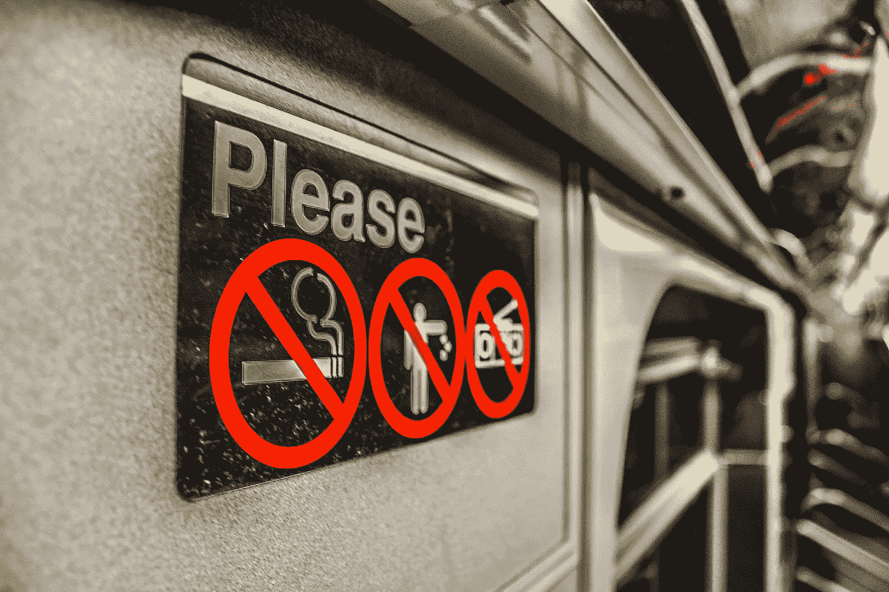

# 为什么吸烟给你能量

> 原文：<https://medium.com/swlh/why-smoking-gives-you-energy-d7001abeaac3>

我总是嫉妒我办公室里的吸烟者。

在任何时候，任何一天，他们只是离开办公室和工作的地方，“出去抽根烟”。

我会看着他们一天做好多次。

我知道吸烟肯定有助于我的社交，因为比起快速去最近的饮水机，吸烟可以让我有更长的时间被迫进行交谈。

但我还是忍住了。

这可能是一件好事。

# 直到我发现了吸烟的另外两个好处。

随着我对高性能世界的深入了解，我了解了诸如节奏、休息以及信不信由你——深呼吸等原则！

## 首先…关于节奏。

这是一种节奏。大自然的四季、昼夜、月亮周期等等。

我们人类也有自己的节奏。

我们专注和放松的能力按照自己的节奏运行。

已经证明，当一个人长时间不睡觉时，各种睡眠不足的症状都会出现。

虽然还不清楚人类不睡觉能活多久，但研究表明，认知功能下降甚至幻觉会在最初的 24-48 小时内出现。

我能找到的人类最长无睡眠运行时间是 264 小时，也就是连续 11 天多一点。

任何呼..我不是来向你推销睡眠的重要性。

我想说的是，连续工作 8 小时，中间不休息，也有负面影响。

这正是吸烟者在不知情的情况下能够利用的东西。

> 吸烟者正在利用他们自然的节奏，一种专注和休息的节奏，这样做可以在每次吸烟休息时给他们的精神电池充电！

所以给我们这些不吸烟的人一个建议…

和一个吸烟伙伴在一起，在你的一天中快速休息一下！

那将会创造奇迹。

谁知道吸烟有它的好处？…

但是等等！从那来的还有更多。

你想知道吸烟的另一个好处吗？

信不信由你，但它确实与…

# 深呼吸的放松效果！

在东方文化中，呼吸被比作生命力、气、气、呼吸..你说吧。

> 不是“我思故我在”，而是“我呼吸故我在！”

毫无疑问，你可能见过一个人点燃香烟，深深吸一口…..你可以看到他们整个身体放松，就在你眼前变化。

## 压力，紧张消失。

真的吗..这并不是尼古丁的影响。而是他们终于深呼吸了一口气，打破了他们的浅呼吸循环！

马上试试这个！

拿着。

A.

很深。

呼吸。

英寸

感觉很神奇吧？

欢迎来到不吸烟的潜在好处！

好了，不妨从吸烟者身上学点东西。

一个真正的大师总是乐于接受新的信息，即使它来自最不可能的来源。

不客气

不，现在不是出去抽烟的时候。

但是是时候去休息一下，深呼吸几次了。

对你的身体有好处。