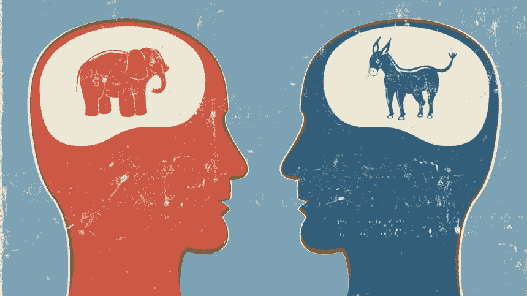

# 为什么社交媒体让我们变得心胸狭窄

> 原文：<https://medium.com/swlh/why-social-media-is-making-us-narrow-minded-ebc8471f0ec1>

Image by The Columbia Lion via Heather Macomber

当我每天醒来时，我的手臂会机械地关闭我的电话闹钟，我的手指甚至会机械地开始滚动我的通知(试图打破这个习惯)。我起床开始为工作或上学做准备，每隔 5-10 分钟，我会花几秒或几分钟查看我的手机，或者刷新我已经看过的东西(试图打破这个习惯)。在上班的路上，我会浏览社交媒体，看看有什么趋势，看看其他新出现的新闻。在一天中的任意时间，我会拿出手机刷新一些东西。

我不想让自己听起来像一个不完成工作的人，因为我确实完成了工作，但直到我随机查看了我 iPhone 的“屏幕时间”,并且有一天我盯着屏幕看了 4 个小时，我才完全意识到我消耗了多少社交媒体。在最初的惊讶之后，我有意识地检查了我使用手机的时间表，并开始看到数字增加。

社交媒体无疑占据了我日常手机使用中最大的一块时间，我想拼凑出我从中获得了什么价值，让我如此冲动地消费它。想想看，我处理了我与社交媒体的互动如何在很大程度上定义了我接受的新闻、内容和观点。

我并不是说它已经取代了所有其他新闻来源，尽管我了解到大约三分之二的美国人(68%)从社交媒体获取新闻。我的思路从“我经常使用社交媒体”变成了“社交媒体给我提供了我所关注的新闻文章和标题。”起初这似乎不是一个问题，但它在我的脑海中停留了一段时间，因为我开始觉得我不能控制我正在看的东西。我只是滚动和观察，当我点击一篇文章时，我会得到更多这样的文章。

所以，我现在要提出一个我一直没有忘记的问题:社交媒体巨头有他们的算法向我们展示他们认为我们最可能想看到的东西。正因为如此，**我们听不到我们构建的泡沫之外的意见。**

我开始更多地研究新闻文章是如何产生供我阅读的，从脸书时间线开始。据[脸书编辑部](https://newsroom.fb.com/news/2016/06/building-a-better-news-feed-for-you/):

"*我们不负责挑选世界应该阅读哪些问题。我们的工作是将人们和想法联系起来，并将人们与他们认为最有意义的故事联系起来。我们的诚信取决于包容所有的观点和看法，并利用排名将人们与他们认为最有意义和最有吸引力的故事和来源联系起来。”*

我们根据“他们认为最有意义和最吸引人的故事和来源”来获取内容，这是一个关键的陈述。那么，脸书如何决定我关心哪些新闻文章和消息来源呢？

滚动浏览我的提要，我会停在一个看起来有趣的新闻标题上(来自我很久以前订阅的某个新闻源),然后点击它并浏览它。过一会儿我打开这个应用程序，就会弹出更多来自那个来源的文章，不管它们是不是政治性的。一开始我并没有注意到，因为很多文章满足了我对被动娱乐的需求，就像《老友记》从最好到最差的所有剧集一样。随着时间的推移，我意识到我所读的是多么片面。

我现在特别谈论政治文章，当我意识到我所阅读的每篇文章背后的意识形态和世界观都是一样的时，这开始困扰我。特别是在过去的几年里，随着政治格局日益两极化，一方的新闻文章往往会嘲笑另一方，我阅读的是一方对世界问题的评论。

根据脸书新闻编辑室的说法，他们对用户的优先考虑是“将他们与对他们最重要的故事联系起来”问题在于，当你向脸书确立什么样的故事对你重要时，你基本上是在让它们不断地向你强化你信仰领域的内容。正因为如此，了解我会消耗多少社交媒体对我来说变得很重要:如果我一整天都盯着屏幕这么长时间，我至少应该有成效地这样做，并更多地了解世界上其他人的想法。我真的不喜欢被封闭在泡泡里的感觉。

这是问题的第二部分。众所周知，这些社交媒体平台在设计上令人上瘾，有无尽的滚动和推送通知。结果是我们漫无目的地滚动，而不是主动地滚动。当我们跳上应用程序时，我们并不试图学习任何东西(至少当我第一次上 FB 时我不是)，我们只是看到了给我们的东西。与此同时，我们仍然在内化片面的政治信仰，因为不管我们是否读过这篇文章，标题足以让我们的头脑接受故事的框架。当我开始处理这个问题时，它让我更加困扰——我限制了我思考世界上正在发生的事情的方式。

如果我们审视当前的政治气候，说它两极分化是轻描淡写的。我一直从文章中看到的主题是，不管是哪一方的政治观点，他们都把另一方描绘成不聪明，不关心阅读文章的人的核心价值观。人们的信仰是有原因的，我认为理解人们为什么会这样想是很重要的，不管你是否同意他们的观点。

YouTube 上我最喜欢的一个节目是“中间地带”，组织者让一个有争议的问题的对立双方的人坐在一起，讨论他们的观点。对我来说，这些富有成效的对话揭示了人们的人性。每个人都有一套截然不同的经历，这些经历构成了他们和他们的信仰体系，在听到他们的故事之前，首先听到你在头脑中与之对抗的人的人性是令人吃惊的。媒体在描绘另一面方面做得很好，它甚至在倾听人们之前就破坏了我们与他们的联系。倾听他们并不意味着赞同他们。

因此，我的问题是社交媒体如何限制我们的观点和/或对人的感知。当然，我们都有能力通过关注/不关注页面来控制我们在社交媒体上看到的内容。我不认为我们对此考虑得足够多，因此，我们对其他人如何看待我们泡沫之外的问题背后的复杂性理解得更少。如果我们妖魔化那些我们不同意的人，我们就不能朝着中间立场努力，在那里我们都可以朝着改善人类状况的方向前进。我想我们忘记了这是大多数人想要的。

总结一下，我能做些什么呢？简而言之，走出你的泡泡，接受其他观点。作为富有成效的讨论的一部分，或者倾听富有成效的讨论，我们会对他人产生共鸣，我认为这种价值观应该定义我们如何与任何人互动。

我所说的一切都不是为了简化问题背后的复杂性和情绪，因为人们有不同的利害关系。如果你觉得你的信仰体系受到了攻击，我主张以让你的声音被听到的方式来抗议。我现在写这篇文章的目的是想表达，我认为我们没有尽力去倾听不同的观点。相反，我们有时会说，如果这个人不同意我的观点，这意味着他们不太关心或不太聪明。

技术有可能强化这种封闭思维，除非我们走出自己的方式，努力去倾听我们通常不会同意的人。最重要的是，不要被它触发，相反，和他们争论/讨论为什么你认为自己是对的。我现在写这篇文章是因为我认为这是即将到来的 2020 年选举中的一个日益严重的问题，我认为这一年有可能继续分裂美国人。归根结底，我们都是人，重要的是，我们要意识到我们应该承认人们来自哪里。

最后，这是我的第一篇文章，所以我认为用这个结尾是公平的。我是一个非常关心他人的人。我渴望成为塑造世界的技术浪潮的一部分，但我更希望看到人们幸福。听到人们的故事，奋斗和对世界的理解，对我来说是不可思议的。技术正在帮助我们做到这一点，但我们需要引导它，以便我们可以使用它作为一种工具来改善人类的条件和我们与他人的关系。