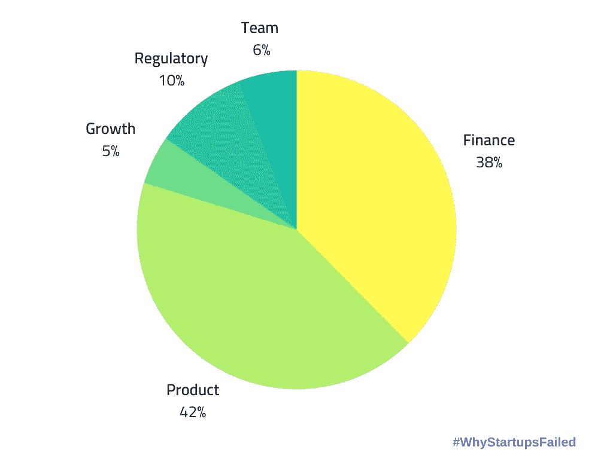

# 创业失败的原因及如何避免

> 原文：<https://medium.com/swlh/why-startups-fail-and-how-to-avoid-it-b21496b0ec44>

在现代社会，创业变得越来越困难。在对风险资本、市场份额的激烈竞争和不断变化的商业环境带来的新挑战之间，当企业家决定创建自己的创业公司时，他们经常会一头扎进不清楚的水域，自然会有相当多的人失败。在本帖中，我们将探究其中的一些原因。

尽管面临这些挑战，我们有数据显示，创业市场仍然强劲。例如，根据 [Fortune](http://fortune.com/2017/02/22/startups-2017-challenger/) 的数据，2017 年，美国自主创业的人数增加了 15 万左右，达到 860.2 万人。这表明，即使在无情的环境下，越来越多的人正在创办自己的创业公司。

此外，创业公司的全球前景同样充满希望， [GEM 全球报告](https://www.gemconsortium.org/report)显示，全球每年有超过 1 亿家创业公司[成立](https://startupstash.com/category/launching/)。这是一个惊人的数字，每秒钟就有 3 家新企业成立。这表明，尽管新成立的企业面临着激烈的环境，但仍不乏愿意冒险尝试经营一家初创企业的人。

一个广为引用的关于创业氛围的统计数据表明，超过 90%的创业公司实际上都失败了，只有 10%的公司真正经历了长期的成功。这个统计数据来自于[创业基因组](http://innovationfootprints.com/wp-content/uploads/2015/07/startup-genome-report-extra-on-premature-scaling.pdf)的一份报告。这其中的原因？根据 Startup Genome 的数据，超过 70%的初创公司都经历过过早的规模扩张，这可以为许多初创公司失败的一个重要原因提供一些见解。Hackernoon 也一直在探索初创公司失败的原因，发布了一张图表[显示，当初创公司失败时，以下原因是最常见的。](https://hackernoon.com/why-do-startups-fail-a-postmortem-of-256-failed-startups-fb157a16d98b)

成功的 10%的创业公司似乎有很多共同点，即使他们不属于同一个行业。首先，他们设法创造了一种产品或服务，完全符合为他们选择的市场解决一个主要问题的目标。其次，他们的团队将具备在危机发生时改变事情的适应性和头脑冷静，以防止他们的创业失败，在商业世界中，停滞最终会导致失败。最后，他们团队的成员将一起工作，不会有严格的协议来坚持你的角色，每个人都将附和自己的想法，以达成小组共识，毕竟两个人总比一个人好。

*   产品:42%
*   金融:38%
*   监管:10%
*   团队:6%
*   增长率:5%

当谈到产品时，从数字上看，这是大多数创业公司失败的主要原因，失败的实际原因是因为产品本身并没有为他们选择的市场提供有效的解决方案。

考虑到这一点，我们将回顾一些你可以做的事情，以帮助你的创业成功的机会最大化，这样你就可以避免一些大多数企业家直接走进的陷阱。

# 不要创造对解决方案的需求

一般来说，创业公司通过声称他们已经找到了某种问题的完美解决方案来推销自己。然后，他们继续谈论他们的服务将如何帮助他们所选择的市场发生革命性的变化，并将彻底消除这个问题。这一切都很好，但是，在为你的创业做计划时，你需要确保你想要解决的问题确实有解决方案的需求。如果只有少数人遇到你要解决的问题，那么几乎没有人会使用你的服务，就这么简单。

你会想要避免很多初创公司创始人正在做的事情，那就是创造一个解决小问题的需求。事实上，你应该做的是，如前所述，找到一个有大量预先存在需求的问题的解决方案。除非你已经是一家大公司，否则你自己创造需求的机会非常渺茫，即使你有很多钱可以支配，你也会因为推动一些没有人真正想要的东西而浪费掉这些钱，你的初创公司会死掉。

创业公司对其解决方案没有足够需求的例子可以在现已倒闭的 Raptr 公司中找到。他们是一家电脑游戏初创公司，允许客户在不影响系统质量和效率的情况下优化系统性能。然而，在他们推出后不久，他们最终在 2017 年失败了。Raptr 在[声明](https://www.pcgamer.com/uk/raptr-online-game-optimization-and-tracking-service-is-shutting-down/)中公布了原因。

声明写道:“今天的世界与我们首次推出 Raptr 时大不相同。许多公司提供游戏优化工具。不再需要一个独立的平台来做这件事”。

这是一个创业公司没有将他们的商业模式集中在对解决方案有足够需求的问题上的例子，相反，这个问题是难以置信的利基，最终，其他 PC 游戏公司能够提供类似的更好的服务，而不需要外部资源。Raptr 的 USPs 和它的工作方式对客户来说不再方便，甚至也不是最佳选择。

# 营销是关键

创业成功的一个最重要的因素就是营销，这是毋庸置疑的。你可以拥有世界上最好的产品，它将彻底改变你的行业，但是，如果你的营销努力延伸到脸书的一些帖子，你将会失败。

为了有效地推广你的创业公司和服务，你需要出现在每一个地方，这样你就能吸引尽可能多的潜在用户。值得庆幸的是，我们现在生活在社交媒体世界，在这里，点击一个按钮就可以找到大量的人。

你可以通过在 LinkedIn、Medium、Quora 等网站上发布视频和各种帖子，利用 SEO，在各种搜索引擎上投放付费广告，来进行自己的营销。此外，如果你觉得你没有能力这样做，你可以咨询外部营销机构来为你处理所有这些。有时，这实际上是最好的选择，因为他们将能够让你付出的钱获得巨大的曝光率，从而为你的创业带来大量潜在客户和嗡嗡声。

旅游初创企业 travelllll.com 就是一个因营销不善而不得不关门的例子。该公司成立于 2011 年，致力于创新传统的旅游业。尽管如此，它们最终还是在 2013 年关闭了

创始人约翰·奥诺兰发布了一份[声明](https://john.onolan.org/travelllll-post-mortem/)解释为什么会这样。

该公司试图通过报道旅游新闻和该领域的初创公司，将新媒体和现代技术方法引入他们的行业。

这句话的意思是“有可能从很多人身上赚到一点钱，也有可能从少数人身上赚到很多钱。从少数人身上赚点小钱，不划算。如果你不卖东西，你最好有很多眼球。我们没有。”

travelllll.com 的问题在于，他们在一个需要有效推销自己才能持续增长的系统中工作。然而，他们不能有效地营销他们的服务，只有几千个持续的用户，这导致了他们公司的灭亡。

# 让你的团队保持亲密

很多初创公司的创始人似乎忘记了一件事，那就是他们自己团队的重要性。你雇佣的人可能从一开始就和你在一起，并且可能对你的创业成功做出了巨大的贡献，但是，像任何员工一样，如果他们对目前的工作不满意，他们会开始寻找另一份工作。员工流动率高对创业公司来说是极其有害的，因为你可能会在你经历流动的领域失去一致性，这可能会导致你的业务效率降低。

为了确保你的员工愿意留下来，把他们当人对待！作为老板，你的团队都有他们自己的特殊要求。你应该探索最大化员工参与度的各种方式，比如投资于工作场所、工作社交场所的福利项目，甚至向长期员工提供公司的部分股权。如果员工觉得他们在工作中有既得利益，比如朋友、股份等，他们就不太可能离开。

你最不希望的事情就是他们去找你的竞争对手，或者更糟的是，失去控制，把你的公司搞垮。

不幸的是，效率低下的团队毁掉一家公司的例子比比皆是。一个这样的例子可以在俄罗斯的电子商务平台 Wikimart 上找到。该公司在国内获得了巨大成功，自 2008 年成立以来，就被贴上了俄罗斯易贝的标签。尽管如此，董事会层面的动荡导致了一系列糟糕的决定，该公司在 2017 年受到了多次破产令。

该网站的联合创始人马克西姆·法尔丁发表了自己的声明，解释了企业失败的险恶原因。“休息了快两年，我在公司待了两天。多数股东放弃了它。该公司没有资产可以保存，也没有能力可以保留。我离开的 20 个月，让“职业”高管们用富有的寡头们的钱扼杀了公司。他们已经花了(卢布)两次(！)比我们 Kamil Kurmakaev 和我从 2008 年公司成立到 2014 年 8 月花费的还要多。所有的东西都丢失或被盗了——大部分都丢失了。”

在这方面，从 Wikimart 中学到的经验是，要确保你身边有一个可以信任的团队。为了激发你团队的忠诚度，你需要确保他们保持快乐。上面已经介绍了实现这一点的一些方法。

# 创造一个让你自豪的产品

作为一个初创公司的创始人，最重要的事情之一就是拥有一个让你引以为豪的产品。如果你有一个平庸甚至低劣的产品，你可能不会对它评价太高，那么，你的顾客也会有同样的想法。拥有更好的产品自然会增加你的业务增长潜力，因为更多的人可能会被更高质量的产品所吸引。当你希望从投资者那里获得外部资金时，这一点也至关重要。

测试你是否有值得骄傲的产品的一个很好的方法是注意你自己的团队是否在没有你参与的情况下公开宣传你的产品。如果是的话，你就成功了，你很有可能拥有一个出色的产品。然而，如果他们不愿意这样做，你可能会弄清楚为什么会这样，你可能会想重新思考产品的某些元素。

有许多公司因为产品不受顾客欢迎而不得不关闭的例子。他们没有考虑产品是否会创造良好的用户体验，也没有花时间去分析产品，以确保它是值得他们骄傲的东西。

政治社交媒体初创公司 VoterTide 就是一个例子。VoterTide 为政治活动、新闻公司和其他组织提供社交媒体分析和监测。

VoterTide 最终不得不关门，其所有者向 CBInsights 发表的一份声明阐明了原因，称“我们没有花足够的时间与客户沟通，并推出了我认为很棒的功能，但我们没有从客户那里收集足够的信息。我们意识到这一点时已经太晚了。很容易被骗去认为你的东西很酷。你必须关注你的客户，适应他们的需求。”

很明显，VoterTide 错误地认为他们的产品是值得骄傲的，然而，当涉及到客户对该产品的实际反应时，很明显他们没有有效地满足客户的需求。这是导致他们最终崩溃的原因。

*原载于 2019 年 2 月 27 日*[*【startupstash.com】*](https://startupstash.com/why-startups-fail)*。*

## 这篇文章发表在 [The Startup](https://medium.com/swlh) 上，这是 Medium 最大的创业刊物，拥有+429，678 名读者。

## 在这里订阅接收[我们的头条新闻](https://growthsupply.com/the-startup-newsletter/)。

