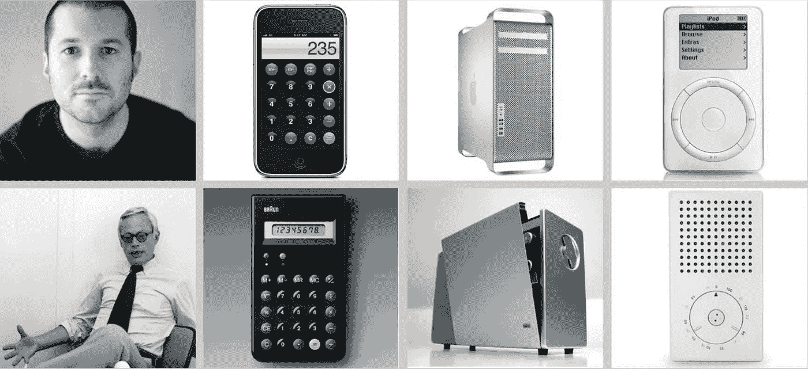

# 为什么史蒂夫·乔布斯以偷窃为荣

> 原文：<https://medium.com/swlh/why-steve-jobs-was-proud-to-steal-13d60a9a048e>

Photo: Getty Images

如果史蒂夫·乔布斯患有一种最常见的创作综合症，他可能根本不会考虑在 1979 年参观施乐帕洛阿尔托研究中心(PARC)。他可能永远也不会看到他几乎马上就意识到的个人计算的未来，PARC 开发的图形用户界面，设计得像一个桌面，把传统的计算机命令行和 DOS 提示符转换成文件夹和文档的图标，用户可以用施乐公司所谓的鼠标指向并点击打开。他可能永远不会接受巴勃罗·毕加索的名言“好的艺术家复制，伟大的艺术家窃取”，并把施乐的界面用于苹果，后来还吹嘘说“我们总是无耻地窃取伟大的想法。”

如果乔布斯亲手挑选的首席设计师和最终的“犯罪伙伴”乔纳森·伊夫也遭受了同样的痛苦，他可能永远也不会“窃取”博朗名声的天才设计师迪特·拉姆斯的设计风格和美学。

但史蒂夫·乔布斯和乔纳森·伊夫不受其影响，伟大的艺术家也是如此，因此他们共同创造的产品设计达到了无与伦比的水平，创造了改变世界的商业优雅。

“它”是 NIH，这是商业文献中“不是在这里发明的”综合症的一个著名的首字母缩略词，他们戴着他们的豁免权就像一个荣誉徽章。也许这是正确的，因为神经科学现在证实，接受他人的想法比提出自己的想法更困难，回报也更少。

## “不是在这里发明的”(NIH)综合症。

如果你不熟悉 NIH，它被定义为对在其他地方，个人或团队以外的地方开发的概念和解决方案的自动负面感知和本能厌恶，通常导致不必要的重复发明。意思是“如果不是我/我们想出来的，我/我们就不会考虑”，以及“我/我们可以做任何你/他们能做得更好的事情。”

NIH 的表达总是一样的:不经适当考虑就立即拒绝另一个人或团体的想法，仅仅因为他们提出了这个想法。(下次当你在大厅等电梯去你的办公室或酒店房间时，数一数有多少人按了上行按钮，即使他们能看到你已经按了。那是 NIH。)

当广告业高管亚历克斯·奥斯本(Alex Osborn)在半个多世纪前向世界介绍头脑风暴时，他提出了运用想象力的四条规则，其中两条侧重于防止想法被拒绝:推迟判断，并以他人的想法为基础。奥斯本在它被称为 NIH 之前就很清楚 NIH，不幸的是，他的规则对我们反其道而行之的倾向几乎没有影响:强加判断，拒绝他人的想法。

维基百科为理解 NIH 的驱动因素提供了一个很好的起点，它指出，他人开发的一个概念经常被拒绝，因为人们“在拒绝它之前没有花时间完全理解它；因为他们必须接受基础设施或术语方面的新概念；因为他们相信他们能生产出更好的产品；或者是因为他们在寻找现有解决方案时不会像发明一个新的解决方案那样获得同样多的赞誉。”

一项针对 NIH 的文献研究显示，它首先是一种素质——后天的态度或偏见——产生于感知的负担、精神负荷或可能的威胁。

NIH 与你认为自己拥有的知识和活动领域紧密相连。如果你是专家，你应该是拥有所有好主意的人，或者是这样的想法。尽管这可能不合理，但如果其他人得到了一个想法或者想到了一个你专业领域内的解决方案，你会莫名其妙地产生一种能力下降的感觉:“我应该想到的！”如果你觉得其他人可能会认为你在某种程度上不是专家，特别是如果那些人碰巧是老板、雇主或客户，恐惧就会悄然而至。这时，你就要加倍采取防御手段，比如 NIH，来保护你的地位、职位或权力基础。

## 国家卫生研究院的神经科学

事情是这样的:出于几个原因，你大脑的生物学可能在 NIH 中扮演重要角色。首先，我们现在知道，处理新概念(无论来自何方)会给前额叶皮层带来沉重的负担。然而，大脑天生就有保存精神资源的能力，所以你几乎会自动抵制新想法，不是因为这些想法不好，而是因为你不愿意花费巨大的精力来集中注意力和建立新的神经连接。

换句话说，这种感觉不舒服，所以你回避它。

第二，你的大脑从别人的想法中得到的化学回报与从你自己的想法中得到的不一样。当你自己解决一个问题时，在洞察到新的复杂联系产生的那一刻，大脑释放出肾上腺素样的神经化学物质，带来积极刺激的体验。

因此，虽然从别人那里窃取想法看起来很容易也很懒惰，但事实并非如此。以一种违反直觉的方式，提出我们自己的想法比接受、吸收和利用他人的想法更容易，也更有回报。

这也许可以解释为什么史蒂夫·乔布斯如此以偷窃为荣……也许他知道自己违背了人性，比别人想得更努力、更好。

## 这篇文章发表在[《创业](https://medium.com/swlh)》上，这是 Medium 最大的创业刊物，有+411，714 人关注。

## 在这里订阅接收[我们的头条新闻](http://growthsupply.com/the-startup-newsletter/)。

