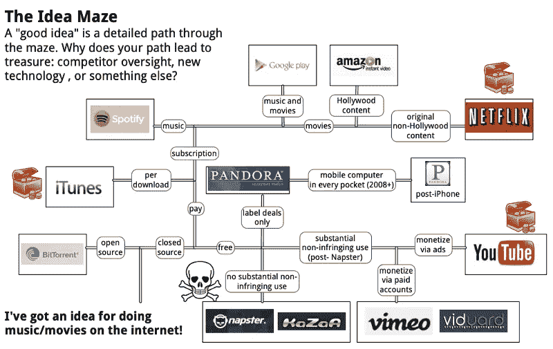

# 为什么科技公司不好

> 原文：<https://medium.com/swlh/why-tech-companies-are-bad-83b0af68a32c>

发展最快的科技公司通常都很糟糕。如此多的科技宠儿最终[违反了法律](https://www.bloomberg.com/features/2016-zenefits/)、[创造了一种可怕的文化](https://www.nytimes.com/2015/08/16/technology/inside-amazon-wrestling-big-ideas-in-a-bruising-workplace.html)，或者[财务崩溃](https://www.businessinsider.com/inside-the-crash-of-londons-payment-unicorn-powa-technologies-2016-4/?IR=T)，令人惊讶的是发现一个还没有。

这不是意外。这是必然的。不是所有糟糕的科技公司都是成功的，但几乎所有成功的科技公司都是糟糕的。

成功的科技公司之所以糟糕，是因为要成为一家科技公司，你必须走上最快的生存之路。

# 思想迷宫

创意迷宫描绘了你的初创公司所有可能的策略。你所做的每一个决定，无论是有意还是无意，都会在迷宫中分出一条路。

有许多[好的](http://cdixon.org/2015/02/01/the-ai-startup-idea-maze/) [迷宫的例子](https://www.ben-evans.com/benedictevans/2016/4/13/the-vr-idea-maze)，但[这里有](https://spark-public.s3.amazonaws.com/startup/lecture_slides/lecture5-market-wireframing-design.pdf)巴拉吉·斯里尼瓦桑的原图:

进入迷宫并不难——任何想法都能让你进去——但找到出路才是。不同的产品解决同一个问题，策略是相互依赖的，不可能完全对应。

你无法预先知道你的道路是否通向成功。如果可以，成功的道路会变得过度竞争，改变迷宫。有一个[想法观察者效果](https://en.wikipedia.org/wiki/Observer_effect_%28physics%29)。

你*可以*提前知道的是，任何在迷宫中生存下来的创业公司都找到了最快的生存路径。

# 预期的

因为你无法预先知道哪条路会通向成功，如果没有竞争，你应该简单地选择风险最小的路。如果没有其他人在迷宫中导航，你需要多久就多久。别死就好。

但是竞争改变了迷宫。

如果有人在你之前建立了 Spotify，你也无法建立 Spotify。通常路径是单一用途的——例如，拥有分发音乐的专有权。

竞争对手走一条更快、更冒险的路会把你更安全的路变成一条死胡同。一个绝对合法的 Airbnb 版本可能会奏效，但可能非法的 Airbnb 夺走了这条路。

在竞争中，最有可能成功的路径是最有可能首先成功的路径*，假设你的竞争对手选择了其他路径*。

# 最快的生存路径

更快的路径通常风险更大，而糟糕的路径通常风险更大。你*可以*在法律灰色地带经营，你*可以*无视有毒文化，你*可以*以后再想出商业模式。你可能会更快地通过迷宫。但是你可能会死在路上。

迷宫中几乎没有竞争者，高风险的道路不太可能有幸存者。如果竞争对手走一条存活率为 1%的道路，他们几乎肯定不会成功。

但是，竞争越激烈，幸存者的胜利之路就可能越危险。如果 100 个竞争者选择了存活率为 1%的道路，那么*大多数情况下，其中一个会成功*。

因为很少有创业成功，有前途的想法不可避免地会吸引大量竞争。这就是为什么成功的创业公司是糟糕的。鲁莽的初创公司几乎总是会赢，只是很难事先知道是哪家公司。

成功的创业公司在灰色地带运营，直到他们变白，文化差到不足以杀死他们，并在以后找出商业模式。他们选择最快、风险最大、实际可行的路径。

他们是最快生存路径的幸存者。

# 依据过去经济发展情形分析的

几乎每一个寻找最快生存路径的公司都会死掉。但有些不会。他们是打破迷宫的公司。

这就是为什么 Airbnb 非法运营、Revolut 虐待员工、特斯拉永久亏损都无关紧要。或者为什么优步做了这三件事，还能上市。他们选择了最快的生存路线。

事先，假设你的竞争对手选择了其他人，那么最有可能获胜的路径就是最有可能获胜的路径。但事后来看，唯一重要的路径是任何人存活的最快速度。这就选出了那些以好换取快的公司。

创始人永远会意外地构建 Theranos、Zenefits 和 Naspter。因为，对于创始人来说，如果不是在最快的生存路径上，做好事是没有回报的。

阅读这篇和更多我在 www.alexcrompton.com 的文章。

感谢企业家第一团队阅读本文的草稿。如果你想走最快的生存之路，从这里开始[。](http://www.joinef.com/)