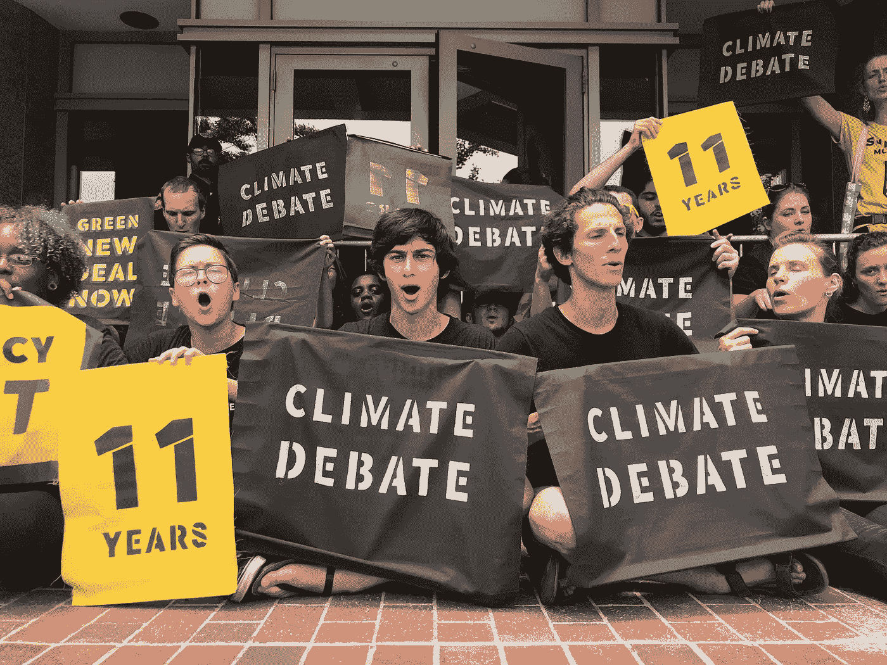

# 为什么民主党全国委员会不想进行气候辩论——这实际上很有道理。

> 原文：<https://medium.com/swlh/why-the-dnc-doesnt-want-a-climate-debate-it-actually-makes-perfect-sense-a4e30d12201d>

Sunrise Movement demands that the DNC allows a climate centred debate

民主党和被提名者都是非常聪明的人，他们知道气候正在发生什么，他们知道气候变化将对他们的选民、他们的国家和整个地球产生毁灭性的后果。那么，他们为什么不欢迎展示候选人进步思想和进一步突出自己的机会呢…