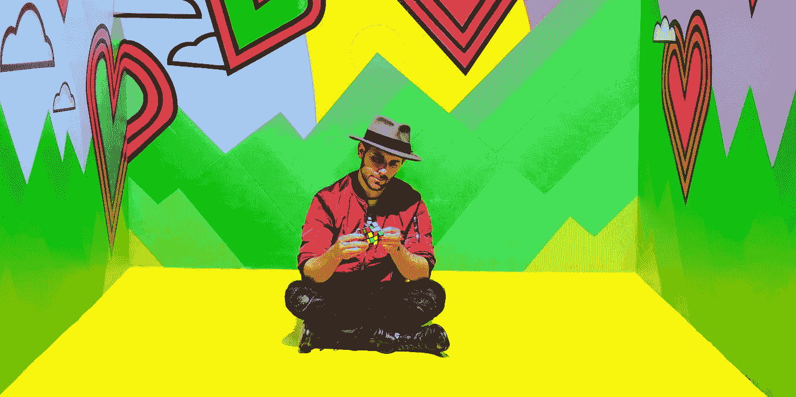

# 为什么我们害怕成为真正的自己？

> 原文：<https://medium.com/swlh/why-the-f-ck-do-we-hide-who-we-really-are-981207733501>

## 向“对审判的恐惧”开战

Photo by [JOSHUA COLEMAN](https://unsplash.com/photos/uB16HY_ah4o?utm_source=unsplash&utm_medium=referral&utm_content=creditCopyText) on [Unsplash](https://unsplash.com/search/photos/weird?utm_source=unsplash&utm_medium=referral&utm_content=creditCopyText)

## 在我们生活的世界里，人们害怕被贴上与众不同的标签。

他们害怕自己会被排斥。不断害怕朋友、家人和同事的评价。