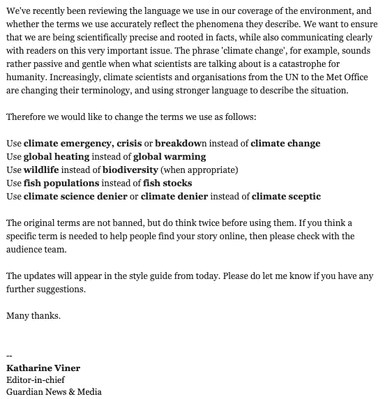

# 为什么《卫报》改变了对气候变化的报道

> 原文：<https://medium.com/swlh/why-the-guardian-is-changing-how-it-talks-about-climate-change-bbf3ec8e3660>

## 语言的重要性:“气候变化”与“气候紧急事件”

Photo by [Karsten Würth (@karsten.wuerth)](https://unsplash.com/@karsten_wuerth?utm_source=medium&utm_medium=referral) on [Unsplash](https://unsplash.com?utm_source=medium&utm_medium=referral)

> “现在是 2019 年。我们现在可以称之为:气候崩溃、气候危机、气候紧急情况、生态崩溃、生态危机和生态紧急情况吗？”
> 
> ——格里塔·图恩伯格

2019 年 5 月 17 日星期五 [*《卫报》*](https://www.theguardian.com/uk) *，*英国最大的新闻媒体之一宣布，它正在改变谈论气候变化的方式。

他们希望确保他们准确地反映了情况，因此建议不要使用被动的术语，这些术语不能表明我们的环境状况有多么紧迫和灾难性。变化包括使用“气候紧急情况、危机或崩溃”代替“气候变化”，“全球变暖”代替“全球变暖”，以及“气候否认者”代替“气候怀疑论者”。你可以在下面的截图中看到完整的公告:

Credit: [https://twitter.com/LeoHickman](https://twitter.com/LeoHickman)

语言很重要。我们选择使用的词汇塑造了我们的思维方式，以及我们对周围世界的理解方式。因此，对于像《卫报》这样有能力影响成千上万读者的主要新闻媒体来说，深入思考所使用的语言至关重要。

气候变化被视为一场“辩论”已经太久了。信徒坐在一边，否认者坐在另一边。新闻媒体纵容这种描述，邀请气候否认者在报纸或电视上与气候科学家一起发言，试图保持平衡。

《卫报》本身讨论了 2010 年围绕气候变化使用的语言。在这个时候，报纸不再使用“气候否认者”这个词——考虑到最近的声明，这个词现在看起来很讽刺。《卫报》的环境编辑当时认为:

> "怀疑论者的观点有道理，我们应该认真对待并尊重它们。"

他们认为，称这些人为否认者“只是贬低和制造差异”。在观点主题中，描述不同的观点是完全符合新闻常识的。但是气候变化不是观点。气候变化是确凿的科学，所谓的“否认者”通常要么不知情，要么与化石燃料行业有联系。

更令人不安的是，不仅仅是新闻媒体助长了这种气候变化的形象。2017 年，在唐纳德·特朗普担任美国总统一年后，美国政府从所有政府网站上删除了“气候变化”一词。这包括环境部。他们用“极端天气”取代了“气候变化”一词，这有效地将人类的责任完全排除在外。

如果我们甚至不能承认气候变化是真实的，现在正在发生，人类在全球变暖中发挥了巨大作用，并使用准确的科学语言来做到这一点，那么我们对未来几年避免气候灾难还有什么希望？

因此，我为《卫报》最终反对这种荒谬的做法而鼓掌。我希望其他许多新闻媒体也能效仿他们。

然而，虽然我同意我们关于气候变化的语言的准确性是至关重要的，但我也认为需要有一个平衡。因为语言塑造了我们理解世界的方式，我也认为有影响力的人和平台(如*《卫报》*)在可能的地方激发希望是很重要的。心理学研究表明，要想让人们受到信息的激励而采取行动，他们需要认识到一个问题对他们来说是直接的、局部的，并且会对人们产生影响。但是，他们也需要从信息中感受到某种程度的积极——感受到一切都没有失去，他们可以做一些事情来解决问题。

所以，如果我们想减少对气候变化的否定，增加积极致力于防止气候变化的人数，我认为我们需要两样东西。首先，我们需要更加明确什么是气候变化，以及它将如何影响个人。向*卫报*致敬，他们在这方面开创了一个积极的趋势。第二，我们需要看到更多积极的、鼓舞人心的故事，关于我们如何克服全球变暖，以及如果我们做到了，我们的世界会变成什么样子。让我们用语言和讲故事的力量开始讲述我们希望成为现实的未来故事。

> “因为去年的话属于去年的语言，明年的话等待另一个声音。”
> 
> ― **艾略特，四首四重奏**

对积极的语言如何激发变化感兴趣？阅读我之前的帖子:[*‘为什么我们需要改变谈论气候变化的方式’。*](/@tabitha.whiting/why-we-need-to-change-the-way-we-talk-about-climate-change-9e43e9d77228?source=friends_link&sk=aeaf9b7d21c9e8f2f06b5e59f921f8ec)

*想从积极的气候变化帖子中获得灵感吗？阅读我之前的帖子:*[*‘应对气候变化:低碳未来会是什么样子？’*](/@tabitha.whiting/surviving-climate-change-what-would-a-low-carbon-future-look-like-7b25a65dff5d?source=friends_link&sk=83b2c4bc9daf11ebb307d2614e7e64c8)