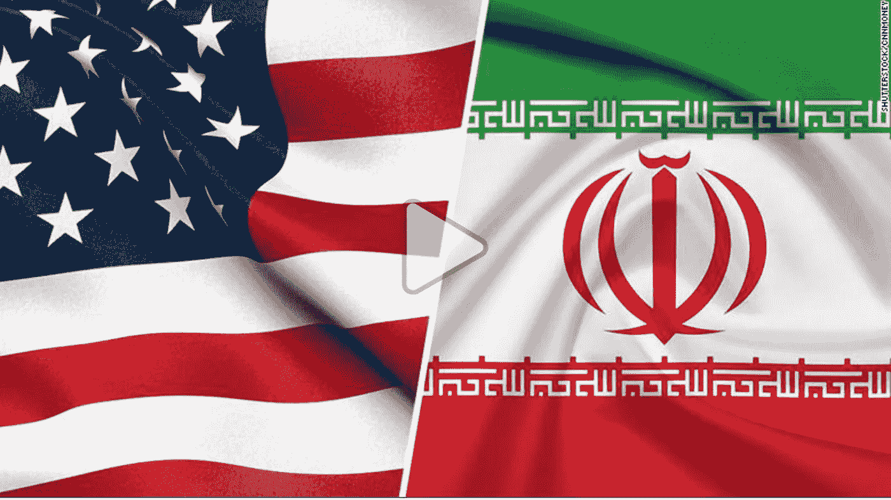

# 为什么伊朗战争从来没有

> 原文：<https://medium.com/swlh/why-the-iran-war-never-was-97524dcd37dc>

Source:[CNN](https://edition.cnn.com/videos/world/2019/06/21/impact-of-possible-us-iran-war-robertson-pkg-vpx.cnn)

美国退出了联合全面行动计划，通常被称为伊朗核协议。尽管国际原子能机构证实其遵守与俄罗斯、中国、英国、美国、法国和德国的协议的所有规定。换句话说，伊朗停止制造核武器以换取取消制裁。这一点多次得到了…的证实