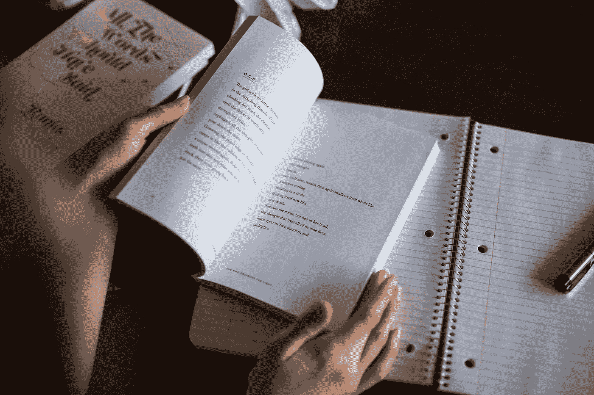

# 为什么《触发镇》是一本优秀的诗人工艺书

> 原文：<https://medium.com/swlh/why-the-triggering-town-is-an-excellent-craft-book-for-poets-40f7a9e8d4b5>

## 我遇到的最好的关于诗人的工艺书籍之一是理查德·雨果的《触发镇》。原因如下。

Photo by [Thought Catalog](https://unsplash.com/photos/PeRNNIGmoNU) at [Unsplash](http://unsplash.com)

# 触发城镇(1979)

说到诗歌的写作，雨果的前三章对我帮助最大。他触及的一个想法…