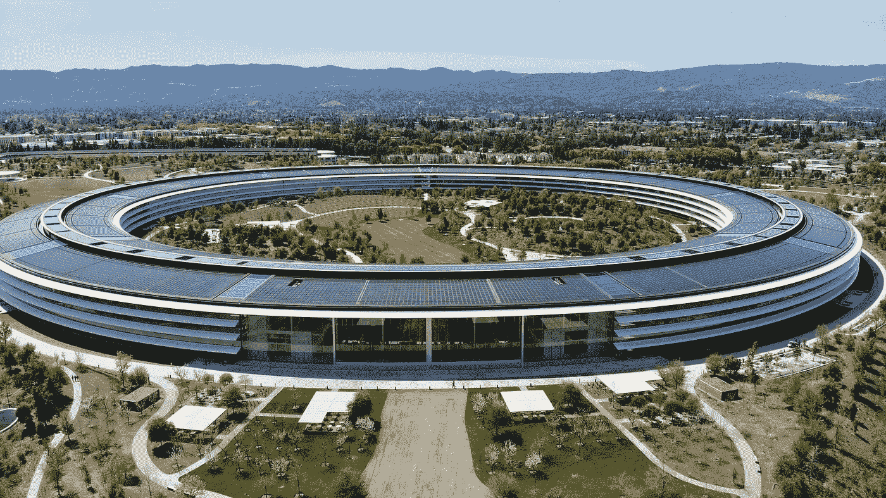

# 为什么世界不再喜欢硅谷

> 原文：<https://medium.com/swlh/why-the-world-fell-out-of-love-with-silicon-valley-3320a86981e4>

Originally published on [**JOTFORM.COM**](https://www.jotform.com/blog/silicon-valley-today/)

如果这是一部电影，硅谷将以好人的形象出现。

在一个由大坏公司组成的世界里，为了人类的更大利益容忍资本主义是一个高尚的例外。是的，赚了几万亿——但只是为了让世界变得更美好。

硅谷是比银行和跨国公司更酷、更好看、更人性化的选择…