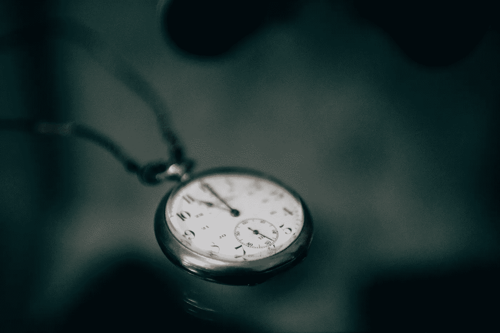

# 为什么时间管理系统不起作用

> 原文：<https://medium.com/swlh/why-time-management-systems-dont-work-b9697746a704>

Photo by [Rodion Kutsaev](https://unsplash.com/photos/UIUgYu9bENU?utm_source=unsplash&utm_medium=referral&utm_content=creditCopyText) on [Unsplash](https://unsplash.com/search/photos/time-management?utm_source=unsplash&utm_medium=referral&utm_content=creditCopyText)

我一生都在研究生产力。

有时候，我对生产力的兴趣比实际生产力更重要。我已经尝试了几乎所有的系统，并为自己建立了几个。每次都希望一个新的系统会以某种方式激励或迫使我进入超高效率，完成大量的工作，比以往更快地达到我的目标…