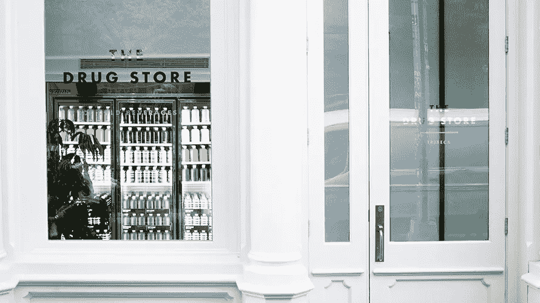
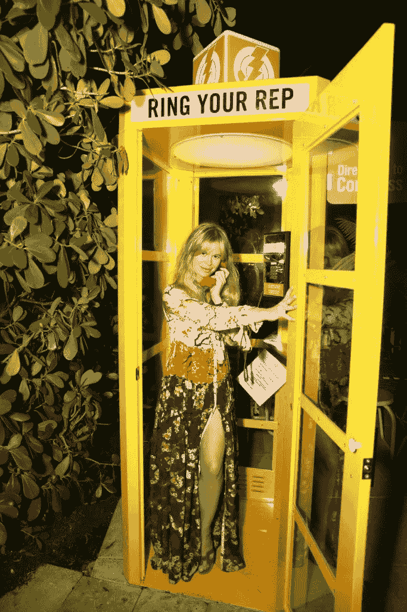
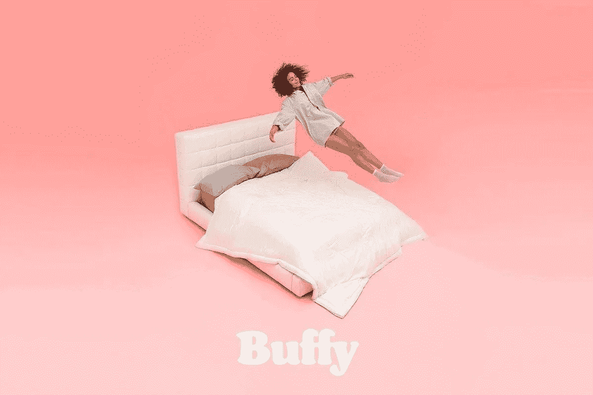
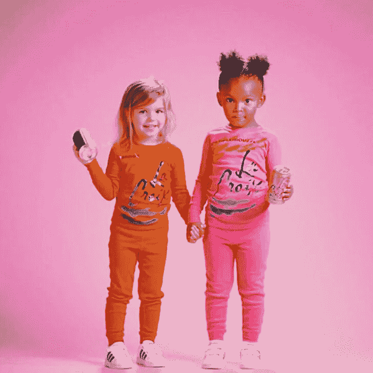
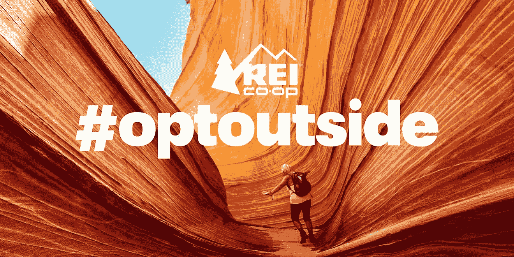

# 为什么花更多的钱做营销却收效甚微

> 原文：<https://medium.com/swlh/why-to-spend-more-on-marketing-and-get-less-results-923b3e165e71>

雇佣一家奇特的广告公司来创造一个概念。找一个优秀的导演，一个只拍电影的人。为超级碗这样的大型赛事购买媒体。还投资了大量的脸书和 Insta 广告。哦，让一群有影响力的人来聊天/发微博/拍照。

结果可能是中等的。但是，遵循营销策略并获得平庸的结果总比做一些不同的事情并失败要好。

**这里有五家公司，如果你想保持领先地位，你应该避免它们的策略。**

# 1.不要像脏柠檬一样乱来

自 2015 年推出以来，脏柠檬一直是千禧一代的饮料宠儿——设计简约，并巧妙地营销“这不是一种净化”饮料，由脏柠檬水(水+柠檬)制成，注入了味道+功能的成分(胶原蛋白带来华丽的光泽，人参带来巨大的能量，木炭带来彻底的排毒)。

去年，Dirty Lemon 开设了药店——这是他们在纽约的第一家实体店。这里的大论点是:这是一个基于荣誉系统的商店。走进去，喝一杯，走出去，发短信付钱。Dirty Lemon 已经在网上订单中使用了短信购买体验。**但这样做能让 IRL 更加信任他们的顾客……并让他们对品牌有更多的评价。**“你听说过脏柠檬吗？你只要拿一杯饮料，然后走出来！”自愿付费看起来似乎是一个冒险的举动——但在对话开始时它会为自己带来回报。

⚡ **避免这种策略** ⚡Buying 你的品牌不需要更好或更容易。所以，不要花费时间或资源去寻找机会去做一些完全不同的事情，这些事情可能会影响流程。

# 2.不要让标准成为你的标准

2018 年 4 月，标准酒店(Standard Hotels)在纽约、洛杉矶和迈阿密的酒店安装了大型彩色电话亭，这是一家以前卫的氛围和观望的人群而闻名的精品连锁酒店。行动的号召？打电话给你的代表。

每个电话亭都设置成直拨国会。拿起电话，输入你的邮政编码，然后给你的代表留言。甚至还有一个关于如何定位你的观点的实用脚本。

自从他们安装了这些摊位，已经有超过 3000 人打来电话，但是更多的人在谈论这件事。

他们还为自己的房间增加了直拨功能，并与美国公民自由联盟(ACLU)和时装周合作，在所有城市举办了“给你的代表打电话”活动。

通过让行动主义变得比以往任何时候都更容易，**标准赋予了客人让他们的声音被听到的权利**——这一使命与他们对激进的自我表达和互联的重视完全一致。他们在自己的空间里发挥创意，把它变成一个平台。

⚡ **避免这种策略** ⚡The 你品牌的核心价值存在于你的品牌平台中——这就是它们的归属。不要召集会议来头脑风暴新的方法，通过体验把它们带到生活中。

# 3.不要像巴菲一样杀人

当 Buffy 推出他们所谓的有史以来最舒适、最干净、最健康和最环保的被子时，他们尽一切努力让人们对最终的舒适购买感觉良好。

可持续制造？检查。没有有害化学物质？检查。部分由回收水瓶制成的填充物？检查，检查，检查。

但真正让人们谈论的是**，这是一种经常应用于其他产品类别的营销技巧——但通常不用于床上用品:**免费试用《魔法奇兵》30 晚。这是一个无风险的免费测试期，直到你被迷住。

**巴菲在这里的胜利是三方面的:** (1) 单就这一点而言，“先试后买”的方法立即传达了信心。这是一家支持其产品的公司，这非常有吸引力。(2)当 Buffy 将这种方法应用于一件以非常私人的方式使用的非常私人的物品(也就是你的床上用品)时，它引起了人们的关注，并让人们谈论它，因为它既独特又受赞赏。(3)通过在 30 天后才给你的卡充值，他们让测试期感觉像一个真正的测试期——而不是麻烦重重的退货。

⚡ **避免这种策略** ⚡Testing 你的营销极限超级可怕。把那些屡试不爽的营销技巧留在他们曾经尝试过的地方。这是他们感到舒适的地方。

# 4.不要被小学教育

每年十月，都有压力为你的孩子设计一套独特的服装。但选择并不多:便宜的聚酯一次性用品或潜在的 DIY 灾难。对于那些缺乏额外时间和狡猾的人才，这是一个真正的恐怖故事。

进入 Primary，这是一个“价格合理的儿童必需品”品牌。为了帮助结束父母的争吵，他们推出了免费的服装礼宾服务。只需打电话给他们，与 DIY 大师联系，他会帮助你将任何想法付诸实践，并一步一步地指导你完成一个尽可能简单的过程，包括在哪里购买额外的布料以及具体需要什么胶水的提示。所有的服装都是从最基本的开始的，其中许多是你在糖果被消费后很久才重新穿上的。

**这项服务成本不高，但它对父母与品牌的互动和对品牌的喜爱有着巨大的影响:**将他们定位为真正关心品牌的首选资源。另外，这也给了父母们一些很棒的话题，让他们可以和所有的妈妈和我谈论。

⚡️ **避免这种策略** ⚡️Everyone 喜欢援助之手。但是不要试图找出一种意想不到的方法来帮助你的客户解决问题。把零食留给孩子们。

# 5.不要像丽一样出去

2015 年，REI 给零售界带来了冲击波。在黑色星期五——购物日的圣杯日——REI 失踪了。他们不仅没有销售和折扣…

他们没有雇员。REI 关闭了购买 IRL 和网上商品的大门——鼓励每个人去户外探索，而不是在室内与人群搏斗。额外收获:他们仍然支付所有员工当天的工资。关闭让每个人都兴奋起来:人们不停地谈论 REI 是一家多么真诚和有爱心的公司。它把极大的注意力放在他们的品牌价值上，以一种与人们联系的方式。

**四年后，他们的首席执行官将现在每年一度的倒闭归功于帮助 REI 度过了零售大灾难——在此期间，超过 200 家大型零售商已经死亡。**其他人也复制了这种方法，但没有人让人们像 REI 一样说话。这场运动已经成为他们核心价值观的一部分。

⚡️ **避免这种策略** ⚡️You 不想让顾客更好地认同你。不要跳出你的大框框去思考——或者想想那些让你的产品实现的人。

# 现在你有了它们…

如果你想成为领先者，你应该避免的五个策略。现在去把你的钱投到你的营销上。

## 如果你喜欢这篇文章，给它一些👏👏👏。

还有跟我学的地方:[**中**](/@Kbrizz)**|**[**LinkedIn**](https://www.linkedin.com/in/kimberly-brizzolara-0b95093/)**|**[**insta gram**](https://www.instagram.com/kimberlybrizzolara/)**|**[**脸书**](https://b-m.facebook.com/brandsthatgetyou/)|[**推特**](https://twitter.com/kbrizz)

## 这篇文章发表在 [The Startup](https://medium.com/swlh) 上，这是 Medium 最大的创业刊物，拥有+435，678 名读者。

## 在这里订阅接收[我们的头条新闻](https://growthsupply.com/the-startup-newsletter/)。

