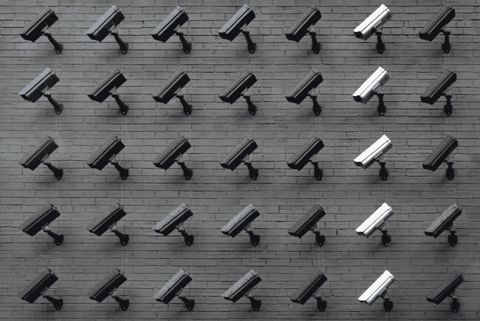
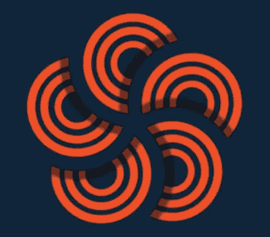

# 为什么使用隐私币可以保护我们作为全球公民的权利

> 原文：<https://medium.com/swlh/why-using-a-privacy-coin-preserves-our-rights-as-global-citizens-9747d888556a>

## 世界上超过 70 亿的居民有权享有隐私权

Photo courtesy of [Jason Dent](https://unsplash.com/@jdent) via Unsplash

## 隐私币是加密货币文化的一个不断增长的子集。本文涵盖了一种独创的[比特币替代品](https://www.cloakcoin.com/en/learn/alternative-bitcoin) —斗篷币。

O 在当今互联的全球社会中，网络隐私变得越来越重要。

数据已经超过石油成为世界上最有价值的资源，我们继续看到网络犯罪逐年上升。

你看，罪犯倾向于追踪金钱的踪迹。如果有一个行业有大量资金流经其生态系统，秃鹫就会下降。

我们一次又一次地看到这种情况——大型、据称安全的组织的服务器被攻破，客户的数据被绑架并在国外出售。

现在，比标准在线环境更危险的是加密领域。潜伏在区块链每个角落的是数字扒手，他们迫不及待地要求你的资产全部为自己所有。

加密空间基本上是不受监管的——给了坏人很多机会来利用不知情的人。

通过使用隐私硬币，你就不会背着一个巨大的目标通过加密网络进行交易。

然而，隐私不仅仅是防止你的财务落入坏人之手。

# 给人们他们想要的

老大哥对你行踪的监视是不间断的，而且越来越具有侵犯性。在大多数发达国家，进入公共场所意味着被拍下来，不管你喜不喜欢。

以中国为例。30 天来，该国政府授权了一个扫描超过 50 万名公民**面部的项目，以追踪一个少数群体的成员。**

**你看，如果有一件事是任何国家的政府都希望持续保持的，那就是对人民的控制。**

**除了暴力之外，向民众展示你的权威的最好方法是限制他们的财政。**

**虽然你可能不愿意戴着面具走在当地的街道上，但斗篷硬币可以让你隐藏你的在线交易。**

> **使用隐私币可以自由管理你在网上分享的财务信息。**

**虽然大多数人没有被强迫去争取完全的隐私或秘密，但他们确实想要控制他们与他人分享的内容。**

**你可能会乐意在社交媒体上发布自己和家人的照片和视频。小比利长得真快！**

**但是你会在 FB 上发布你的支票账户余额截图吗？我猜你不会。**

**这就是为什么——如果你用加密的方式进行支付——斗篷币是这样一种 [**有效的比特币替代品**](https://www.cloakcoin.com/en/learn/alternative-bitcoin) 。**

**所以，虽然你对公众监督的权力有限，但你对自己的财务有更大的控制权。**

**而且，斗篷硬币远远超出了“私人”牵引的概念。使用他们尖端的隐形技术让你无法追踪交易。**

****

**100% anonymous payments**

# **真实匿名**

**斗篷币公司的加密混合软件——Enigma——促进了窥探的眼睛看不见的资金交换。**

**该项目的安全和不可追踪的支付系统使得不可能确定发送资金的数量、来源或目的地。**

**不像比特币网络那样，每个人的存款、支出和余额都可以公开，英格玛交易不属于公共领域。**

**而且，这个项目把他们的硬币放到了他们的嘴边！**

## **觉得幸运吗？**

**从现在**到 2019 年 6 月 19 日**–GMT+1 上午 0:00，该项目给每个人一次机会 [**赢取 10，000 枚斗篷硬币**](https://www.cloakcoin.com/en/blog/enigma_competition) 。**

**那么，你怎么能赢呢？答案很简单，但任务却不简单。要获得 10，000 英镑的网络本地加密货币，你必须破解他们软件复杂的交易混合器。**

**他们会提供一个交易 ID——就像区块链版的购买收据——你只需要告诉我们谁发送了资金，谁收到了资金，以及发送的斗篷硬币的总数。**

**斗篷硬币为他们的交易堡垒感到自豪，并不指望任何人来认领这笔赏金。如果真的出现了赢家，他们会利用这些信息让网络变得更加强大。**

**祝你好运！**

# **包扎**

**随着我们越来越多地在网上度过日常生活，我们需要更多地控制谁可以访问我们的数据。**

**目前，保护你的在线隐私是一个积极的选择。虽然隐私是世界上每个人都应该自动享有的权利，但某些个人和组织并不同意。**

**CloakCoin 努力保护您的财务隐私，并继续招募商家参与团队的使命，使互联网成为一个更清洁的环境。**

**使用斗篷币支付商品和服务可以让你不被那些追踪你一举一动的人发现。**

**从政府到广告商，从网络浏览器到社交媒体平台，互联网上挤满了希望管理你的个人资料的团体。**

**你没有要求，但无论如何它正在发生。**

**虽然网上交易可能令人恐惧，但区块链可能更令人恐惧。任何在这种环境下做生意的人都有隐私权，而斗篷硬币旨在给他们这种权利。**

**简而言之，保护在线交易免受隐私侵犯的最简单方法之一就是使用隐私币。**

> *****免责声明*** *:这不是投资或理财建议。本文中的信息主要是推测性的观点，仅供娱乐。***
> 
> **在参与任何项目之前，无论是在加密市场还是在加密市场之外，都要进行自己的研究。作者持有文中提到的项目的原生加密货币—$斗篷。**

## **无耻的插头**

**如果你喜欢这篇文章，请点击掌声。不会痛的，我保证。现在就开始尝试吧！您的支持有助于这篇文章在整个区块链世界传播。**

**如果你想把你的加密信息传递给大众，我很乐意听听你的项目。**

**即使你只想聊聊加密或你最喜欢的区块链创新，你也可以在这里找到我:Gmail 的 blockchainauthor**

**而且你可以随时联系 [**Crypto Twitter**](https://twitter.com/CryptoBlastoff)**