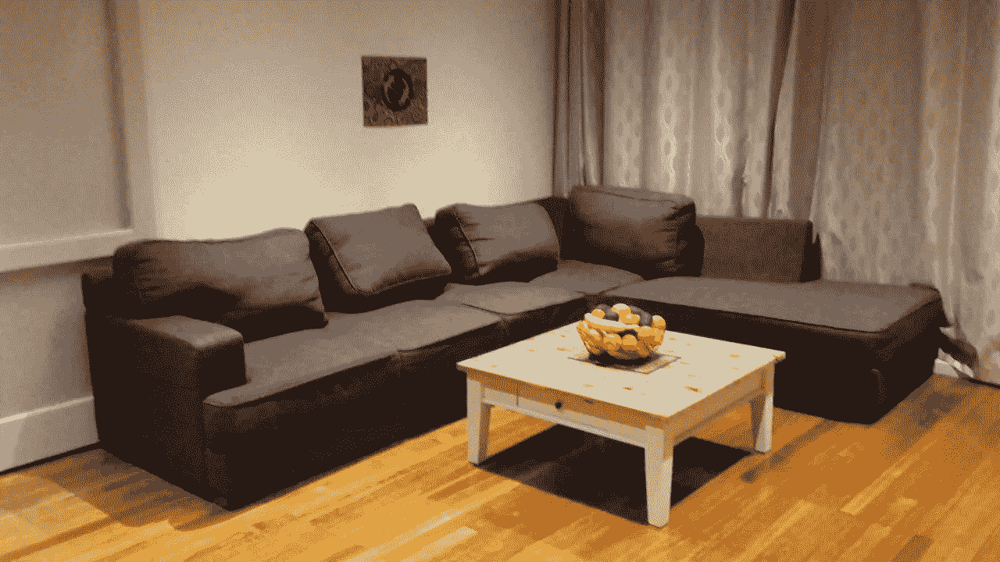

# 为什么我们买这么多垃圾

> 原文：<https://medium.com/swlh/why-we-buy-so-much-crap-8cb5ace7b242>

当我第一次搬出家时，艰难的垃圾周是我一年中最喜欢的时光。在那个神奇的九月，我以前漫无目的地在附近闲逛变成了令人兴奋的寻宝活动。

每个路边石堆都有潜力。在一堆无害的破椅子下面，放着一套原始的日本茶具，仍然密封在原来的盒子里。被扔进一个生锈的浴缸里——一堆看似从未读过的流行儿童书籍。至少不是用肮脏的手。

我愉快地回忆起那一天，我们推着/拖着我们的乒乓球台沿着 1.5 公里的路来到它在车库里的新家。见鬼，我甚至花了一个小时汗流浃背地把一辆“崭新的”7 座休闲车一件件拖到街上(24 小时后，我得意地在 Gumtree 上以 300 美元的价格卖掉了它)。

Yep — that’s it. I’m not even kidding. And before you ask… yep. The coffee table was from a nature strip too

确实是的。只要努力工作，艰苦的垃圾生活不仅有趣，而且有利可图。

但随着时间的推移，这种光泽逐渐开始消退。

追逐的刺激被一个事实掩盖了。无论任何特定的住宅在任何特定的一年里扔了多大的一堆垃圾，第二年，另一个巨大的垃圾会再次在同一个自然地带爆发。

买，查克，买查克。冲洗并重复。

它没有坐好。感觉就像每个人都在之前的 12 个月里疯狂购物，只是为了达到他们房子的“垃圾容量”，迫使旧的东西为新的让路。

但是为什么呢？为什么会有不断积累的冲动？

我将此归咎于两种卑鄙的现象:感知的和计划的过时。

*“那是**T5 所以 最后一季”；感知过时的基本前提。这个系统让我们感觉到我们现在的东西已经不够用了。而且它必须升级，以免我们的地位降级。***

*我们中有多少人冲出去买最新的“更好”的手机……而没有真正质疑它会给我们的生活带来什么好处？买了新衣服是因为我们现在的衣柜完全是 2018 的？因为最新款的车涂上了红色指甲油，还能在我们开车的时候和我们说话，就把一辆完好的五年前的车卖掉了？*

*对你所拥有的感到满足的问题是这对生意不好。心满意足的顾客不会买垃圾。如果出现这种情况，企业就无法转移库存。经济逐渐停滞。没有人喜欢地面经济。*

*所以我们被诱导感到不满。*

*当与下一款产品对比时，我们看似闪亮的新产品突然看起来不再那么闪亮和新颖了。其他人都有。为什么不呢？毕竟，我们告诉自己，新的会让我们更快乐。*

*我们兴高采烈地交出现金，然后跳舞回家玩我们的新奖品。*

*经济给了我们飞吻。大自然厌恶地哼了哼鼻子，把鸟扔给了我们。*

> ****计划报废****

*尽管意识到的过时在维持购买周期方面效率相对较高，但企业并不真的相信我们自己会造成足够的浪费。所以他们以**计划**淘汰的形式给了我们一点帮助。*

*计划报废是你的真空吸尘器在保修期满后两个月就报废的原因。为什么 2017 款充电线不适合 2018 款设备？为什么，在 2-3 年后，你的手机开始比一只乌龟和一只树懒在三条腿的鸡蛋和勺子比赛中跑得还慢。*

*并不是说设计人员不够聪明，不能做出持久的东西。但是和满足感一样，可持续性不是一个支持经济的概念。*

*如果你做的东西非常好，以至于可以永久使用，没有人会需要再买一个。如果没有人需要再买一个，你的客户就不再是客户了。经济磨…等等等等。你明白了。**

*所以东西是特别设计的**而不是**才能持久。也就是说，即使你不是那种渴望最新时尚的人，你也不得不去买。因为你的旧东西不可避免地濒临灭绝。*

*显然，这不是一个可持续的模式。无论我们在地上挖多大的洞，最终，地球容纳废弃垃圾的能力是有限的。*

*但是普通人能做些什么呢？*

*有计划的淘汰是一件困难的事情。我不喜欢有机会说服任何大公司的首席执行官去追求一种会给他们带来更少收入的商业模式。*

*但这并不意味着我们必须放弃那些旨在放弃我们的东西。*

*已经有组织涌现出来对抗我们的垃圾危机。圣基尔达的这家修理咖啡馆由手巧的志愿者组成，他们会免费修理你带给他们的坏东西。这个[网站](http://www.jeco.org.au/reuse-repurpose-recycle/)概述了在墨尔本哪里可以回收你不再喜欢或不再使用的东西。即使是坏掉的东西。*

*至于所谓的过时？嗯，这是我们完全可以控制的。这只不过是精神上的问题……好吧，这很重要。*

*所以，不要让那些爱管闲事的商业混蛋决定你做什么，不需要什么。勇敢的去赞美而不渴望。拥抱“不时髦”。*

*感受那个肮脏的字眼。*

*满足于你所拥有的。*

**我不买整个“但想想经济！”论点。毕竟——在不太遥远的过去，曾经有一段时间，人们创造出经久耐用的产品。不知何故，人们保住了工作，赚了钱，世界继续转动。*