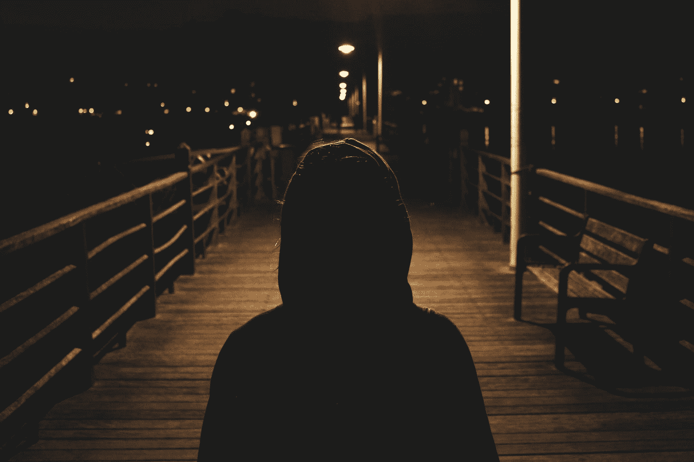

# 为什么我们害怕批评和拒绝

> 原文：<https://medium.com/swlh/why-we-fear-criticism-and-rejection-cba30da7b06b>

Photo by [Paul Garaizar](https://unsplash.com/@enjoythesilence?utm_source=medium&utm_medium=referral) on [Unsplash](https://unsplash.com?utm_source=medium&utm_medium=referral)

> "赞美和批评最终都是基于某种形式的投射."—比利·考根

这发生在我们每个人身上。你有一个你认为是爆炸性的想法。你四处打听，其他人也认为这是个好主意。所以你付出了努力，牺牲，甚至是金钱来实现它。最后，你向世界展示了你的想法，你感到非常自信。也就是说，直到…