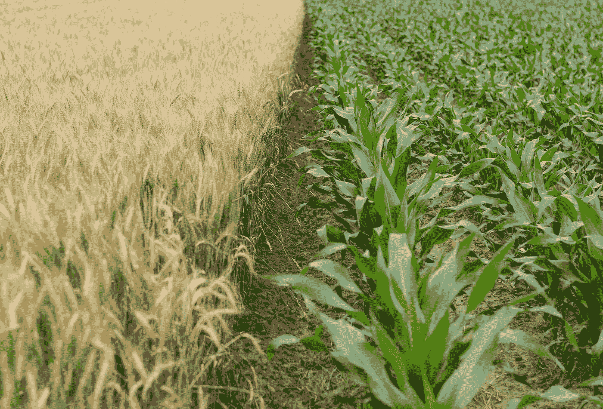

# 为什么我们需要在休闲季节保持“正常”

> 原文：<https://medium.com/swlh/why-we-need-to-be-ok-in-the-fallow-season-1d049d4e6d05>

## 奋斗如何孕育成长

Photo by [Henry Be](https://unsplash.com/@henry_be?utm_source=medium&utm_medium=referral) on [Unsplash](https://unsplash.com?utm_source=medium&utm_medium=referral)

你是否处在一个似乎没有任何结果的赛季？

*你是否在工作中原地打转，并且因为看不到你想要的结果而感到沮丧？*

*或者你只是因为没看过*而放弃了一个你花了无数时间的项目或爱好……