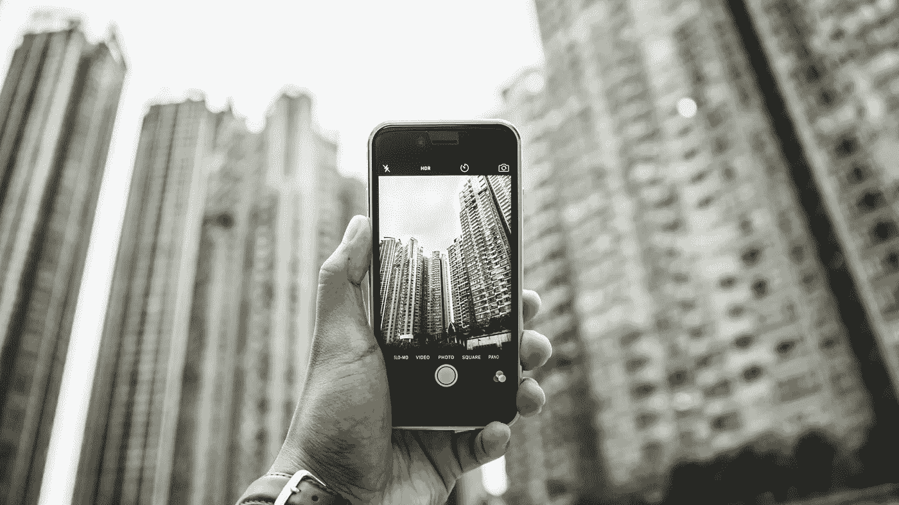

# 为什么我们需要从根本上重新构建大的技术辩论

> 原文：<https://medium.com/swlh/why-we-need-to-radically-reframe-the-big-tech-debate-cc84c13a4a1c>

> “科技是邪恶力量的十大理由”
> 
> “社交媒体平台如何撕裂社会的秘密真相”
> 
> “黑仔机器人接管如何毁灭人类”

我们见过多少次这种令人瞠目结舌的点击诱饵标题？当谈到辩论技术的利弊时，即使是所谓的质量媒体似乎也加入了小报的行列，尽管它们声称是严肃的。

当我们没有被危言耸听时，我们反而被硅谷巨擘描绘的技术乌托邦的美好画面所淹没。像谷歌、亚马逊、脸书和苹果，也被称为大科技，每年都虔诚地制作精心制作的使命宣言。他们颂扬技术的无处不在，同时掩饰责任、透明度和隐私等问题。

尽管观点不同，但技术批评家和技术官僚在表达各自观点时有很多共同点。哗众取宠推动了讨论，导致了一场陈腐、两极分化和徒劳无益的辩论。

显然，迫切需要更新和重塑当前的科技辩论，以打破僵局。那么我们该如何着手呢？

以下是一些开始的方法:

## **让更广泛的公众参与讨论**

媒体机构经常采用“让专家来决定吧”的方法，从著名的赞美诗或辩论中快速引用来形成讨论的关键。

虽然有必要利用专业知识，但同样重要的是通过让公众参与来扩大参与范围，公众是受技术影响最大但最少参与讨论其影响的幻灭人群。

此外，记住“公众”不是一个单一的实体，而是一个丰富多样的社区组合，这将使我们能够发现同一项技术可能以截然不同的方式影响人们的情况。算法是一个典型的例子，固有的偏见[放大了对已经被边缘化的群体的歧视。](https://www.newscientist.com/article/2166207-discriminating-algorithms-5-times-ai-showed-prejudice/)

随着数字领域对用户体验(UX)的强调，将这种模式推广到更广泛的技术讨论中是很自然的。

## **运用光谱思维**

现有话语的特点是对技术进行无所不包的分类，要么本质上是善的，要么本质上是恶的。

过于简单的叙述经常被使用，很容易滑入人们现有的参考框架，挤压任何辩证对话的机会。

确认偏见和回音室也在这里发挥作用，我们不是寻找新的信息，而是寻求验证现有的倾向。

如果我们真的想解开技术驱动的变化的细微差别和复杂性，我们需要利用光谱思维。从僵化的隔间转向流动的梯度将使我们能够解开经常被二分法思维模式的约束所遗漏的粒度洞察。

## **从影响中分离意图**

根据脸书发布的[意向声明](https://www.theguardian.com/technology/2012/feb/01/facebook-letter-mark-zuckerberg-text)，其目的是*帮助人们与他们想要的人联系。*'

今天，这个技术巨人做得更多。

我们亲眼目睹了它是如何经常助长极端主义意识形态、传播错误信息并导致抑郁症和焦虑症的。

这些功能经常被马克·扎克伯格的抽象独白所掩盖，其中夹杂着诸如“建立全球社区”等准深刻的表达。

关注现代技术如何在现实世界中使用，而不是为什么最初设计它们，否则会被忽视的失败和陷阱将被带到最前沿。

## 那么下一步是什么？

今年，以人为本的运动蓬勃发展，这可能为更广泛的技术辩论铺平道路。

苹果首席执行官蒂姆·库克最近[敦促](http://Apple CEO Tim Cook: It's Time for Action on Data Privacy | Time.com time.com/collection/davos-2019/5502591/tim-cook-data-privacy/)行业巨头在数据隐私和网络安全方面采取措施，同时认识到用户的中心地位，

> “技术有潜力让世界变得更好，但如果没有使用者的充分信任和信心，它永远不会实现这种潜力。”

脸书似乎在效仿扎克伯格的 2019 年[决议](http://Mark Zuckerberg's 2019 resolution: To host public discussions on tech https://www.livemint.com/Technology/.../Mark-Zuckerbergs-2019-resolution-To-host...)来

> “主持一系列关于技术在社会中的未来的公开讨论——机遇、挑战、希望和焦虑。”

鉴于 2018 年的动荡事件，从苹果 iPhone [电池“节流”](https://www.wired.co.uk/article/iphone-battery-replacement-throttling-ios)到脸书- [剑桥分析公司](https://www.bbc.co.uk/news/technology-45976300)丑闻，这些承诺应该有所保留。

我们确实知道的是，*真正的*技术辩论仍然需要发生。问题是，这是否会在今年最终发生？

## 这篇文章发表在 [The Startup](https://medium.com/swlh) 上，这是 Medium 最大的创业刊物，拥有+439，678 读者。

## 订阅接收[我们的头条新闻](https://growthsupply.com/the-startup-newsletter/)。

