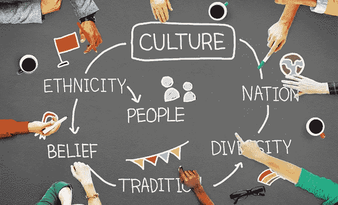
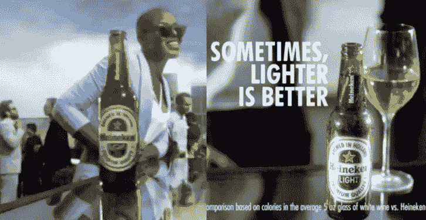
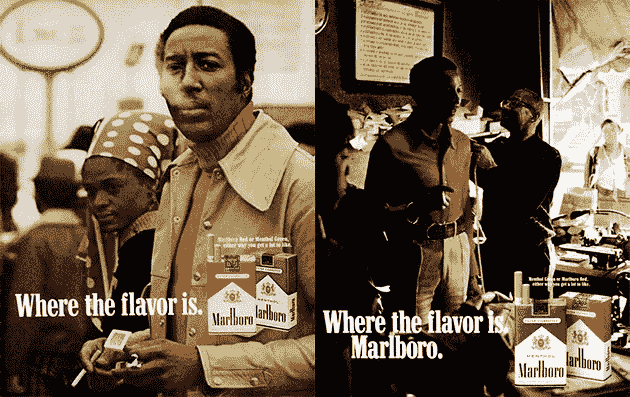

# 为什么我们需要重新思考广告中的“多样性”

> 原文：<https://medium.com/swlh/why-we-need-to-rethink-diversity-in-advertising-a0058f373657>

话语很重要。我们如何定义它们也很重要。

(Photo: courtesy Wikimedia)

故事是我们可以在我们的文化中分享的最强大的艺术，作为家庭，作为公民，以及——在一个越来越互联的世界里——消费者。随着公司提供的产品和服务数量的增加，他们跨文化讲述的故事也必须增加。

任何伟大的讲故事的人都知道他们的观众。公司必须努力真实地体现他们身边的活生生的故事。

2018 年[尼尔森研究](https://www.nielsen.com/us/en/insights/news/2018/the-database-meeting-todays-multicultural-consumers.html)报告称，美国多元文化消费者的综合消费能力为 3.2 万亿美元。这些钱不会轻易花在那些把自己的身份局限于贬低和毫无根据的刻板印象的行业上。

多样性是我们用来描述差异的不带感情色彩的词。在我们不断变化的世界中，差异是不可避免的。公司必须考虑的更大问题是，如何让有色人种参与进来，并在塑造迎合他们的信息方面受到重视。

在一个把谁视为困境之源的世界里，你不会感到被包容。

公司将客户视为实现成功的社区成员，这一点比以往任何时候都更加重要。随着全球化带来更多跨文化的产品和服务，公司正在建立的世界取决于他们信息背后的努力。

(Photo: courtesy of Heineken)

去年，喜力啤酒[播出了一个商业广告](https://www.usatoday.com/story/money/business/2018/03/27/heineken-pulls-lighter-better-commercial-after-some-call-racist/461395002/)，其中一名酒保将一瓶啤酒从三名深色皮肤的顾客身边滑过，递给一名肤色较浅的女性。标语写道:“有时候，越轻越好。”。

黑人社区的强烈抗议很快就爆发了。对数百万有色人种来说，该公司将其产品的吸引力与某人的肤色相比较。当公司忽视其信息的文化含义时，就会发生这种单一的攻击性广告。

直到 70 年代初，菲利普莫里斯公司试图直接向黑人烟民销售万宝路香烟，但收效甚微。他们的广告描绘了 19 世纪黑人牛仔的形象，实际上是模仿现有广告中的白人形象。

公司[雇佣了黑人广告人](https://interactive.wttw.com/playlist/2018/06/28/tom-burrell)，汤姆·伯勒尔，来开发“黑人万宝路人”

对伯勒尔来说，这个“黑色万宝路男人”是成功的，留着非洲式发型，活跃在自己的社区里。他只是碰巧也喜欢抽万宝路香烟。

(Photo: courtesy of Marlboro)

他的竞选获得了巨大的成功。但竞选团队意识到了白人领导的竞选团队没有意识到的是什么？用伯勒尔自己的话说，它承认黑人“不是黑皮肤的白人。”

如果我们想讲更多真实的故事，那么我们必须培养更多的讲故事的人。这意味着由未得到充分代表的社区为其开发信息。

行业领导者应该让有色人种参与到伟大的艺术创作中来，尊重他们所珍视的文化和传统。如果你把消费者包括在内，他们就会把你包括在他们的生活中。