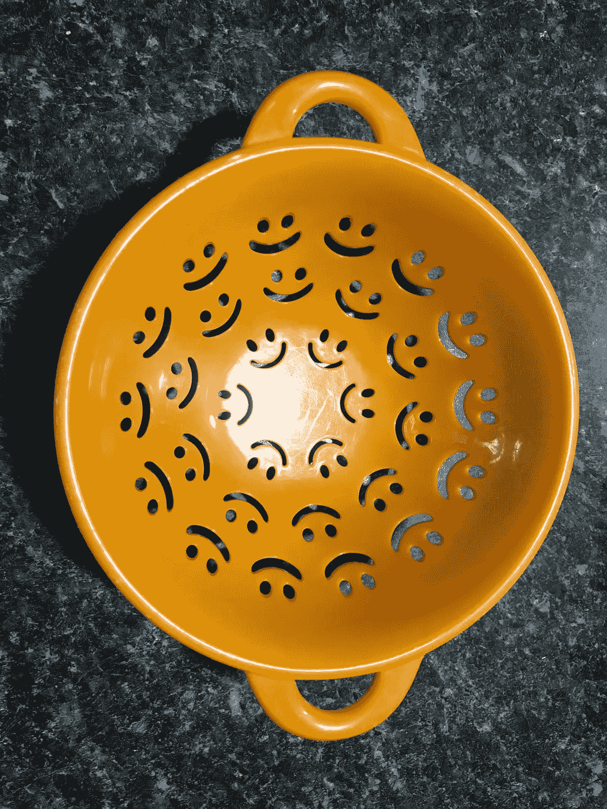

# 为什么我们需要用令人振奋的东西来包围我们有创造力的自我

> 原文：<https://medium.com/swlh/why-we-need-to-surround-our-creative-selves-with-uplifting-stuff-4322bf9a94fc>

*你的环境如何影响你的最佳作品*

现在是密西根州的草莓采摘时间。采摘窗口非常小，农场完全是疯狂和混乱的——充满了被自己绊倒的家庭——试图获得那种自我采摘的体验。