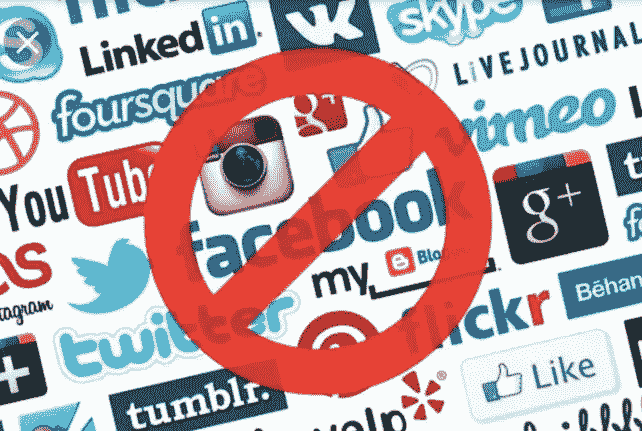

# 为什么我们应该退出社交媒体，但绝对不会

> 原文：<https://medium.com/swlh/why-we-should-quit-social-media-but-definitely-wont-fc93b03ae3ea>

社交媒体不再有趣了。我们必须面对事实，并认识到我们所签署的已经迅速演变成一场与全球恐怖分子的死亡竞赛，这些恐怖分子掌握了如何将交战工具操纵成个性化的战争导弹，这些导弹在没有邪恶创始人的严格指导下进行打击。