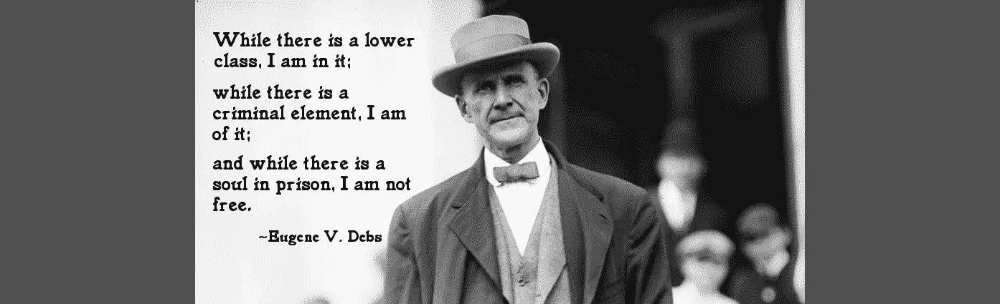

# 为什么我们不应该希望人们坐牢

> 原文：<https://medium.com/swlh/why-we-shouldnt-wish-jail-on-people-6d72616dae3f>

> “只要有下层阶级，我就在其中；只要有犯罪分子，我就在其中；只要有灵魂在监狱里，我就不自由。”
> ――尤金诉德布斯

我经常听到有人希望某个人被关进监狱，或者被判更长的刑期，或者不被释放。我知道说一个人“属于监狱”可能是一种比喻，但这意味着…