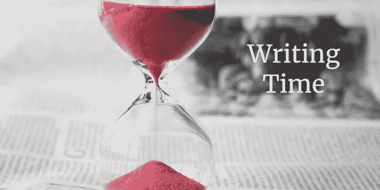

# 为什么写作比你想象的花费更多，更少的时间

> 原文：<https://medium.com/swlh/why-writing-takes-more-and-less-time-than-you-think-e6e2072b26ac>

人们经常问我花了多长时间写了一些东西:一本书，一篇博客，一篇论文，等等。

我怀疑他们想知道的是:你投入了多少时间？

我一直不知道怎么回答。即使我追踪我的时间，我会在哪里划线？我会计算花在决定写什么或思考主题上的时间吗…