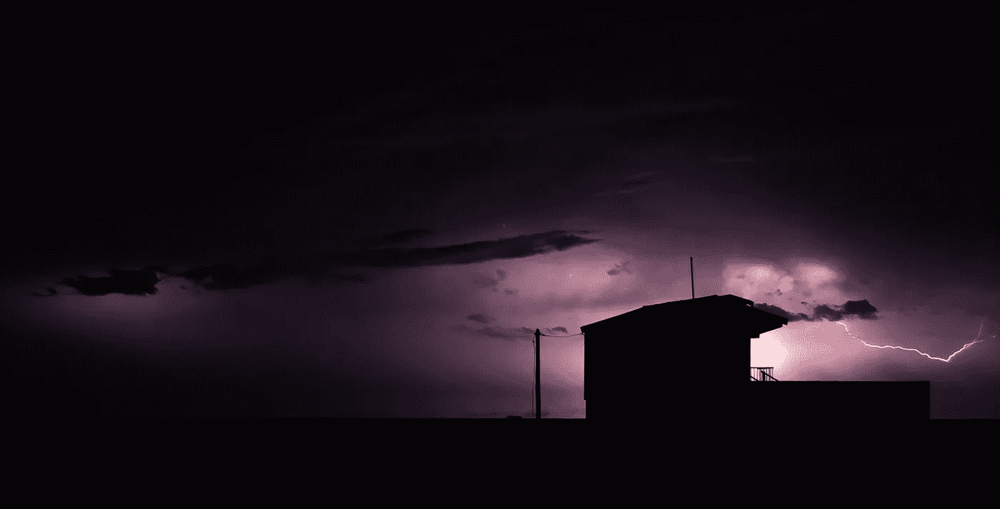

# 你为什么推迟艰难的决定:害怕坏事

> 原文：<https://medium.com/swlh/why-you-delay-hard-decisions-fear-of-the-bad-thing-4207bde27ca0>

The Bad Thing — Photo by [Spaylia](https://unsplash.com/@spaylia?utm_source=unsplash&utm_medium=referral&utm_content=creditCopyText) on [Unsplash](https://unsplash.com/search/photos/bad-storm?utm_source=unsplash&utm_medium=referral&utm_content=creditCopyText)

## 改变现状很可怕，但这是你的工作

你必须告诉吉姆一些困难的事情。你会雇佣其他人而不是他，或者他被调离一个项目，或者他必须管理一个需要转变的团队，这将是一项艰巨的工作。你已经犹豫了一段时间，也许几周，也许几个月。