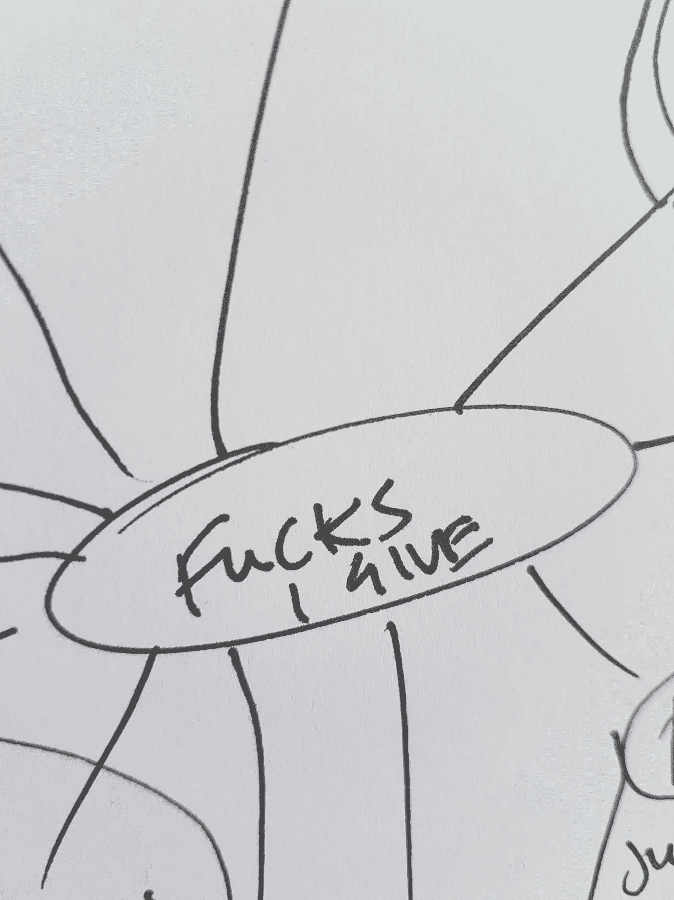
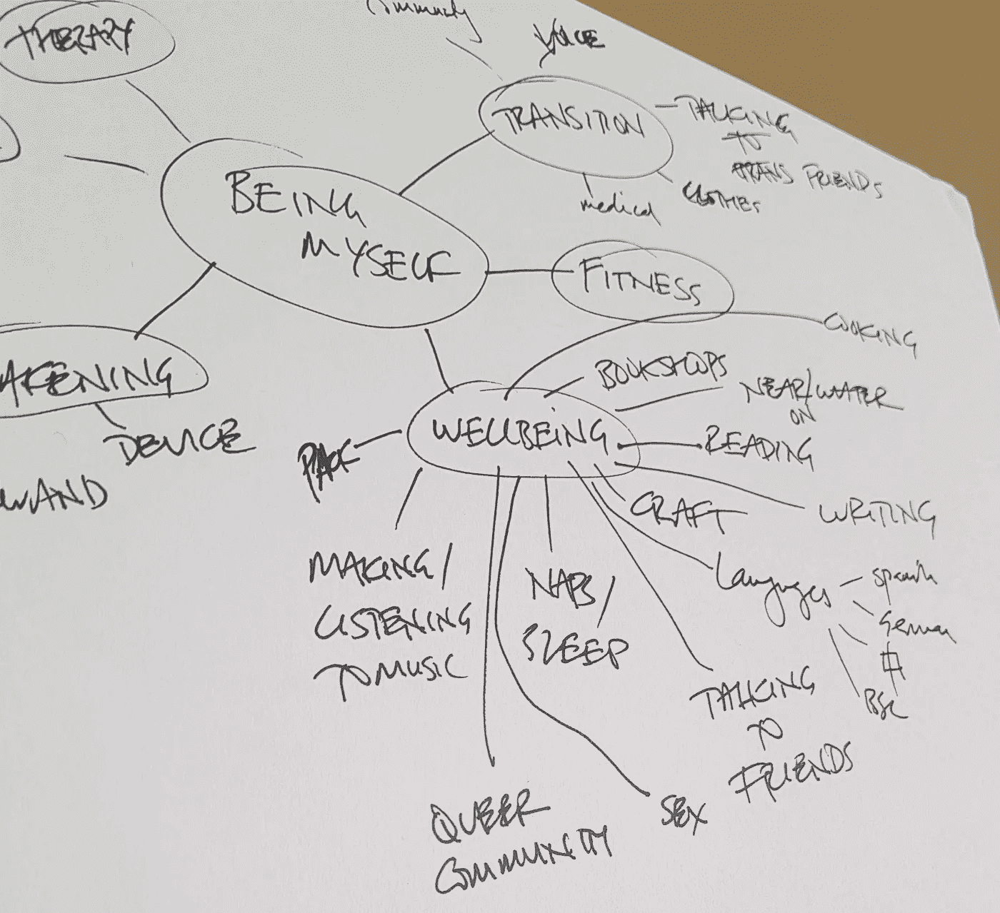

# 为什么你需要一个“我干的”清单

> 原文：<https://medium.com/swlh/why-you-need-a-f-ks-i-give-list-e3394000c2d8>

## 你的数量有限。你把它们花在什么上面了？

## 人生是巨大的。你是有限的。界限是需要的。

我的一个手下开始读一本关于少管闲事的书，这个概念很吸引我。我有时有相当多的漏洞(特别是当我关心的人感觉不积极的时候)，我很容易患上行星疼痛麻痹。

我也经营自己的生意，很擅长启动新项目，也很关心很多事情。

我读不下他选的那本书——我觉得太刺耳了。几天后，我在曼彻斯特度过了一个下午，在水石镇的咖啡馆里工作。我拿起一本类似的书，作者完全不同，(抱歉是作者版税)一个小时就把整本书浏览了一遍。

它写得很好，有非常清楚的说明，但似乎是关于停止关心那些我一开始就不关心的东西。婴儿送礼会和员工慈善呼吁。我的边界问题比那更深一点！

## 然而，它确实促使我列出了一张清单，列出了我真正在乎的事情。

不知何故，这让我更容易知道我真正关心的是什么，并排除其他一切，而不是反过来。也许对你来说也是如此？

# 所以我拿了一张纸，在中间写了“我干”,然后开始画思维导图。

首先是:**工作和金钱，关系，朋友，做我自己，社会公正**和**气候危机**作为我的大类。

我很快就对每一个进行了更详细的介绍。

例如，工作和金钱包括客户、前客户和共鸣动力(谁喜欢‘营销’？呸。我的教练客户找到我是因为他们对我和我的工作产生共鸣。)

共鸣势头下去:[视频](https://www.youtube.com/watch?v=WiROSDD4_U0&list=PLr7wklBMNJMrxWw5XPP4pyHHHqxTsP_Qe&index=2)，中帖(*嗨*！)、[网站](http://megalightheart.com/about)、联系人、一杯茶、每月公/私领导小组(在策划阶段)。

在“朋友”下面，我记下了我超级亲密的人，然后仔细检查了我的手机/脸书，确保我没有错过一大串我真正关心的人。

从像气候危机这样的冻结压倒一切的类别中剔除是关键。我到底在乎什么？

我意识到我关心的是:支持甜甜圈经济学项目，写作，与气候组织的领导人合作，与运动中的白人合作，消除种族主义/白人主义，总的来说不那么糟糕，召集团体。有些是期望，有些是现实。

社会正义是:阅读、写作、放大和召集。

由于那个角落变得有点拥挤，我很快就离开了，开始了新的一页。

做我自己会导致

*   (性别)过渡
*   健康
*   性
*   幸福
*   疗法
*   神奇/精神的东西。

转变是:声音的东西，衣服，医疗，与跨性别的朋友交谈，并在跨性别社区的厚度。

**福利包括:**

*   烹饪
*   书店
*   靠近水或者在水上
*   阅读
*   写作技巧
*   语言
*   小睡
*   和朋友聊天
*   性
*   酷儿社区
*   制作/听音乐
*   和我的人在一起。

**看到它是如何工作的了吗？**

> 这是*所以*令人欣慰的是，看着展开的两页纸，看到‘是的，这就是一切’。

我列出的做爱清单提醒我可能会忽略的事情，并强调如果我花时间在这些事情上，我会明智地度过我的做爱(因此这是一个疯狂而宝贵的生命)。它也与你掌控全局的能力密切相关。

这也磨练了你判断“我这样做是出于职责吗？”如果一些东西的能量感觉不到与其余项目的连贯性，它们就不会上升。

我想这是一项正在进行的工作，随着我和我的生活的变化，我会回到这个话题上来。

感觉很结实。连贯。有*边界*。

你还在等什么？

## 你他妈的在乎什么？列个清单！