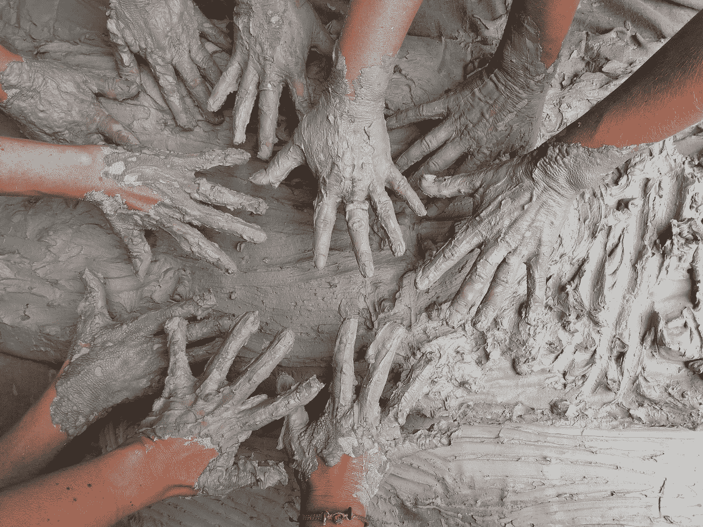

# 在你的创作过程中拥抱混乱

> 原文：<https://medium.com/swlh/why-you-need-to-embrace-mess-in-your-creative-process-5d36a121e90d>

Photo by [Karen Maes](https://unsplash.com/@karen1974?utm_source=unsplash&utm_medium=referral&utm_content=creditCopyText) on [Unsplash](https://unsplash.com/search/photos/mess?utm_source=unsplash&utm_medium=referral&utm_content=creditCopyText)

如果你在 Medium 上写博客的时间足够长，你可能会发现关于“阴谋者”和“色狼”的讨论。不，这不是描述一个古怪的恶作剧版本的《权力的游戏》(尽管这将涉及大量的情节和戏谑)。实际上是对两类作家的描述。