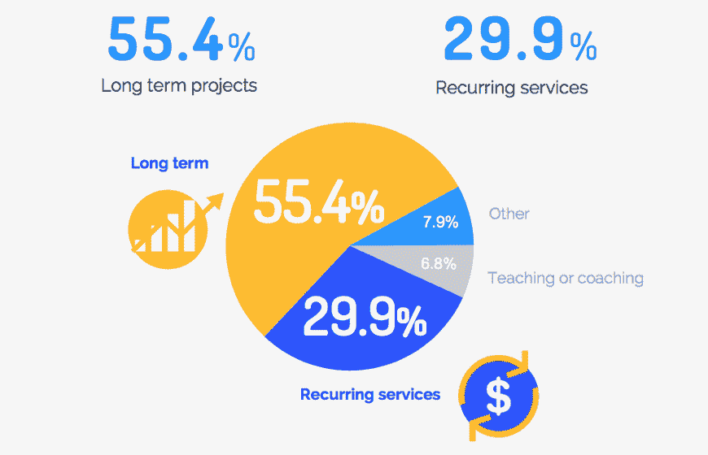
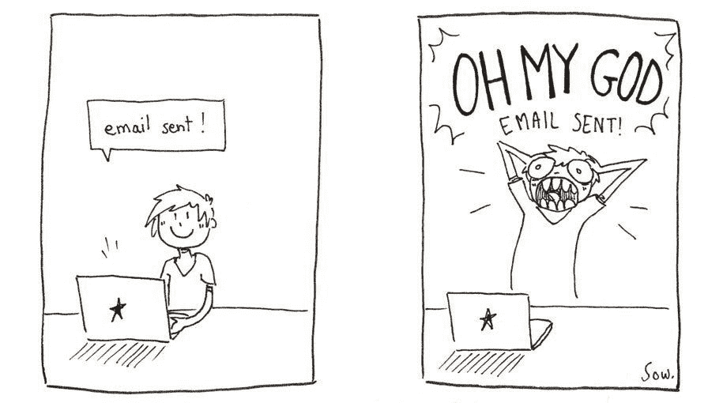
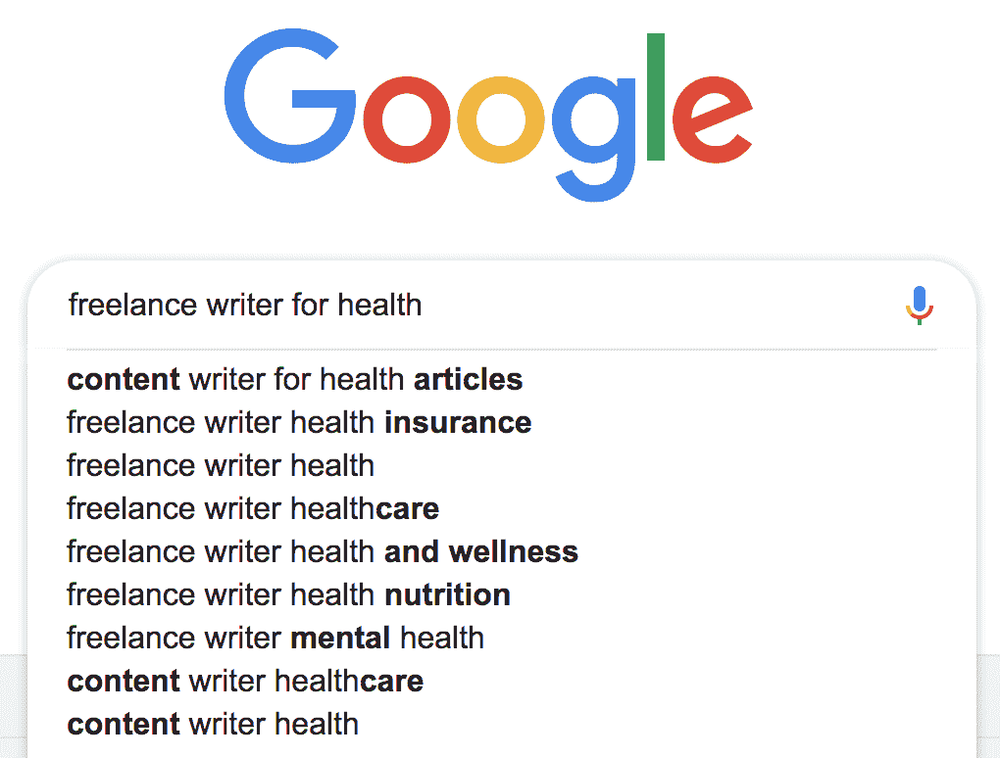

# 为什么你需要停止推销自由职业者的工作

> 原文：<https://medium.com/swlh/why-you-need-to-stop-cold-pitching-for-freelance-work-9495f0139272>

我知道，我知道:冷投球现在很流行。

背后的推理是合理的。我的意思是，如果人们不了解你的业务，他们怎么可能了解你的业务呢？

推销让你有机会直接进入梦想客户的收件箱，并向他们证明你有能力推动他们的业务。

现在，我是[早期冷推销](http://wanderful-world.com/2015/11/16/pitching-new-freelance-clients/)的超级拥护者(我甚至有[关于如何以正确方式做](https://wanderful-world.teachable.com/p/pitch-prosper)的课程)。一遍又一遍地让自己面对拒绝和糟糕的重影是可怕的，但是它给了你作为自由职业者所需要的坚硬的皮肤。

但是…有时间和地点。

我的自由职业之旅已经进行了五年，你想知道我这个月发了多少冷推销吗？**零。**

你想知道在过去的*年里我发了多少冷投吗？* **又是零。**

这并不是因为我害怕点击发送按钮，或者找不到时间到处给一些很棒的品牌发几封电子邮件，而是因为我不需要这么做。

在过去的两年里，我接触到的几乎每一个客户都来找过我，不管是通过我的网站、社交媒体、面对面交流还是通过介绍。

事实上，我认识的自由职业者都很棒(不管他们是六个月前还是六年前),他们不会发出冷冰冰的推销。像我一样，他们有客户敲他们的门，在某些情况下，在街区周围排队。

对于自由职业者来说，长期项目比重复性服务或其他形式的工作更有利可图。 [*来源*](https://blog.hubstaff.com/2017-freelancing-trends/) *。*

# 但是我如何到达那个阶段呢？

然而，那些成功的自由职业者并不是靠坐下来放松，等待客户来找他们，从而达到他们现在的位置。

我敢肯定，他们中的很多人在早期职业生涯的大部分时间里都投出了冰冷的球，但我敢打赌，他们成功的背后还有另一个原因。

**他们在网上的存在。**

投球只是迈向更大更好的第一块垫脚石。

你*真的*认为那些自由职业者会在冰冷的球场上按下发送键，祈祷希望吗？

答案是一个大大的否定(这可能也是一件好事，因为它为新的自由职业者提供了游泳和参与行动的空间)。

相反，他们正在做三件关键的事情:

*   细分市场(无论是选择特定的受众还是特定的行业)
*   将自己定位为所在行业的专家
*   建立联系和关系

> 准备好接受这个自由职业的事情了吗？！观看我的免费培训，它将向你展示如何定期寻找和获得高薪客户。

# 作为一名自由职业者，冷投球的好处是…

[来源](https://www.demilked.com/daily-struggle-introvert-freelance-sow-ay/)

我以前说过，现在我再说一遍，冷投球不是一件坏事。

事实上，如果你刚刚开始，你应该现在就开始，而不是看这篇文章！

但是，当你一直在与伟大的客户合作，有一个了不起的投资组合支持你，有一本充满精彩推荐的手册，你真的想在*希望*有人看到你的潜力的时候*向天空发送电子邮件吗？*

这与整个“忙碌”的心态有关，我真的不认为这是自由职业的一部分。

你看，**自由职业是一种*商业模式，*它不是对那些不断从一份合同跳到另一份合同、寻找下一份薪水支票的人的描述。**

当你已经有了既定的客户名单时，冷推销可能会弊大于利。两年过去了，你不想每周花三个小时给不了解你的品牌写广告，希望他们会雇佣你，对吧？

肯定有更好的办法！*(哦，哎，剧透:有)。*

此时，你*知道*你的价值，你*知道*客户应该来找你。

这就是我所说的自由职业的“第二阶段”,它基本上涉及到将你的事业提升到一个新的水平，并使其长期可持续发展。

**以下是一些值得思考的问题:**

如果你仅仅依靠推销来获得客户，如果你错过了一周或者*但愿不要错过*——一个月会怎么样？*那会不会意味着你生意的终结？*

如果答案是肯定的，那么你还没有建立起持久的自由职业事业。

如果你的企业可能会因为你没有发出足够多的冷冰冰的电子邮件而破产，那你就做错了。

# 但是我不应该一直推销我的生意吗？

作为自由职业者的一个关键问题是，你通常是一个人的乐队。

只有你，你，你做所有的市场营销，行政任务，财务，和实际的工作。

因此，当你得到一份大合同时，其他人就很容易从缝隙中溜走。突然，合同结束了，你什么都没有安排好。因此，拥挤的循环又开始了。布勒格。

这就是为什么建立你的网上形象是建立你的自由职业的重要部分。

虽然花时间推销就像把意大利面扔向墙壁，希望它能粘在墙上，但花同样多的时间在你的在线形象上工作会提高你的 SEO 排名，让你的名字出现在那里，并为客户找到你提供一个更长期的方法。

# 除了推销，还能做什么

所以，如果你准备好开始你自由职业生涯的第二阶段，以下是你要做的:

# 1.小生境向下

小生可能意味着两件事之一。

首先，你可以通过选择特定的目标受众来进行细分，无论是新妈妈、硅谷的科技品牌还是当地的花店。

其次，你可以通过选择一个特定的技能组合来缩小差距。如果你是一名作家，你可能会撰写白皮书、撰写长篇博文，或者专注于为客户构建登录页面。如果你是一名设计师，这可能意味着要专注于制作徽标、完整的网站或印刷材料。

# 2.把自己定位成专家

这是建立你的网上形象的最重要的部分之一，因为人们更有可能信任知道他们在说什么的人(而信任会促成销售)。

有很多方法可以巩固你的专业知识，包括:

*   在你的专业话题上写博客
*   在网站上发布关于你的专家主题的客座博文
*   报名参加你所在行业的采访和播客
*   参加会议和社交活动，分享你的专业知识
*   就你的专业主题在活动中发言

# 3.建立联系和关系

我是[与客户建立关系的*超级*拥护者](http://wanderful-world.com/2018/08/16/meaningful-client-relationships/)。

事实上，我认为这是作为自由职业者你能做的最重要和最有价值的事情之一*。如果我没有花时间去了解我的客户想要什么，并与他们建立关系，对许多人来说，这种关系已经持续了近五年，我不确定我会有今天。*

这个过程的这一部分包括通过评论、论坛或社交媒体真正倾听你的观众，并为他们提供内容、服务和产品，帮助他们解决可能存在的关键问题。

从那以后，继续建立这种联系是很重要的，无论是通过电子邮件营销序列、脸书上的社区，还是只是偶尔通过电子邮件与他们联系。

这些人会把你推荐给其他品牌，给你更多的工作，通常会称赞你，所以你希望他们站在你这边。

# 冷投球还没死

冷投球远未死亡。事实上，这是我推荐新的自由职业者做的第一件事，因为它能快速建立牵引力。

但是，一旦你有了客户名单，是时候提升你的业务了，不要再给陌生人发邮件了。这是转换时间，你不再去找客户，而是他们来找你。

通过这样做，你就为创建一个可持续的自由职业企业打下了基础，这个企业将在未来几年保持成功——怎么样，嗯？！

*本帖最早出现在* [*浪迹天涯*](http://wanderful-world.com) *。*

> 在你走之前…
> 
> 别忘了观看我的免费培训，它向你展示了我每月获得高薪客户的滴水不漏的策略。

## 这篇文章发表在 [The Startup](https://medium.com/swlh) 上，这是 Medium 最大的创业刊物，拥有+443，678 名读者。

## 在这里订阅接收[我们的头条新闻](https://growthsupply.com/the-startup-newsletter/)。

