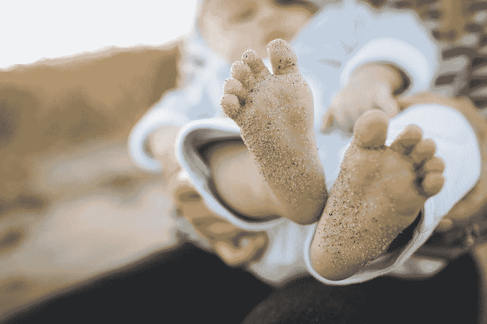

# 为什么你需要剥离生活的本质

> 原文：<https://medium.com/swlh/why-you-need-to-strip-life-down-to-its-essence-df04e19ef522>

[Danielle MacInnes @dsmacinnes](https://unsplash.com/@dsmacinnes) via Unsplash

## 以及我是如何在购买新手机时意识到这一点的

在最近的一个周一晚上，我发现自己身处一个最痛苦、最沮丧、最沮丧的地方。我自己的地狱。

是的，我正试图升级我的手机。

## 我太天真了