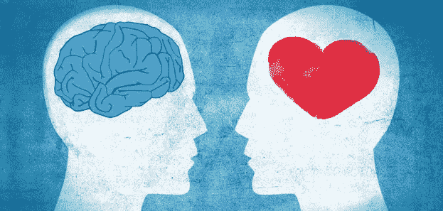

# 为什么你(可能)不应该相信你的直觉

> 原文：<https://medium.com/swlh/why-you-probably-shouldnt-trust-your-intuition-de85df8b3ac9>

“相信你的直觉”。

我们经常从那些倾向于发表毫无根据的言论来激励自己(或者获得 Instagram 上的赞)的自助大师那里听到这种说法，这一次也不例外。

***为什么？***

我们先来定义一下直觉。

> 本能地理解某事的能力**，**不需要…