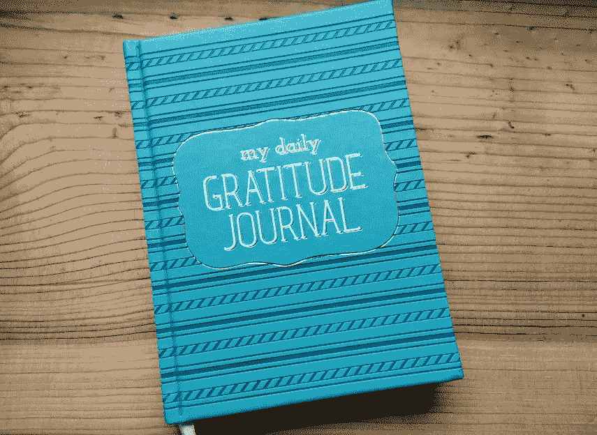

# 为什么你应该是一个习惯性的放弃者

> 原文：<https://medium.com/swlh/why-you-should-be-a-habitual-quitter-fa2d32afb93a>

A symbol of my quitting

## 以及为什么在意识到这一点后，我感到更快乐、压力更小、罪恶感更少

三月初，我和我的家人去了一家图书百万店，去储备新的阅读材料。在前门不到 6 英尺的地方，一个漂亮的 5x7 日记本吸引了我的注意，上面印着“我的每日感恩日记”。我很好奇。