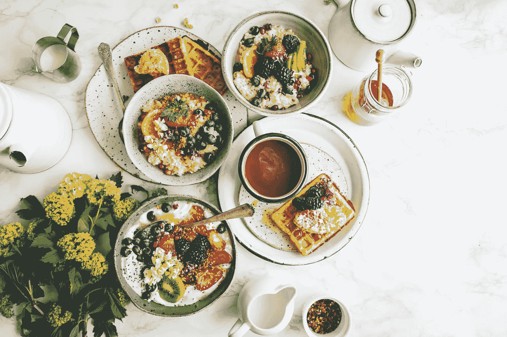

# 为什么你应该每天吃同样的早餐

> 原文：<https://medium.com/swlh/why-you-should-eat-the-same-breakfast-everyday-7a93cc6855b4>

Photo by: [Brooke Lark](https://unsplash.com/@brookelark?utm_source=unsplash&utm_medium=referral&utm_content=creditCopyText)

一碗热燕麦片，一茶匙肉桂粉，一点牛奶，上面放一根香蕉和一点蜂蜜，一杯热摩卡，一个全蛋煎蛋，加一小撮盐和胡椒。这是我过去五年来每天都吃的早餐。当我告诉人们我的这个清晨习惯时，他们的第一反应会是这样的:

“你不觉得无聊吗？”

对此我回复如下

“你对呼吸空气感到厌烦吗？”

Jk 我没那么残忍(而且我在聚会上很有趣)，但对我来说，每天早上吃同样的早餐这种感觉上奇特的概念就像呼吸空气一样平凡。所以这个问题的答案很简单:不，我不会感到无聊，因为我虔诚地将整件事视为生活中必不可少的一部分，从我的字典中完全删除了“无聊”这个词。

不知何故，坚持这个习惯五年让我的生活发生了意想不到的积极变化。这件事对我生活的最大影响是，我在不用做决定的情况下节省了大量时间。通过消除选择的幻觉，我的早晨例行公事变成了我每天早上都期待的自动化。这个想法在直觉上看起来是如此自然和有价值，以至于我开始对它做一些研究，我很快发现有人为它提出了一个术语:它被称为“**决策疲劳**”。

“决策疲劳”一词通常与决策和心理学联系在一起，指的是个人在长时间决策后做出的决策质量下降的**。这种情况发生在日常生活中，比如当你在漫长的一天工作后，躺在沙发上，而不是去健身房，或做一顿美味的晚餐，或洗衣服——因为躺在沙发上是很容易的默认决定。此外，研究表明，决策疲劳是商业领域和司法程序中非理性权衡的原因之一。**

以史蒂夫·乔布斯为例——苹果公司的战术大师，冷血的 CEO，硅谷的技术天才。是的，他就是这样，但他同样出名的另一件事却常常被公众所忽视:他标志性的黑色高领毛衣。很难在网上找到他不穿黑色高领毛衣的照片——事实上，你可能很难想象他穿其他衣服的样子。这是因为史蒂夫·乔布斯，脸书创始人马克·扎克伯格，他以他的灰色 t 恤而闻名，以及成千上万其他类似的从业者，都很清楚地知道，通过消除他们衣柜里的决策疲劳概念，他们清理了顶部空间，以改善他们生活的其他各个方面——包括帮助他们做出更好的商业决策。

除此之外，众所周知，晨间的例行活动具有**精神治疗**的特性。这是因为原本会花在积极思考和决定早餐或衣柜选择上的时间已经不存在了；它们被解放一个人思想的自动化所取代，允许他们简单地活在当下。此外，通过腾出时间，你有额外的早晨时间来养成新习惯，也许这是你一直想做但从未找到时间去做的事情，比如冥想，这本身就有无穷的好处，可以给你的生活注入更多的积极因素。

我试图与大家分享的主要观点不仅仅局限于早餐——它集中在“决策疲劳”的整个概念上，这个概念贯穿于你生活的每一个方面。通过更加关注你**每天不需要做出的选择，你在决策权的有限领域中释放出有意义的空间。**

让我以《名利场》杂志采访巴拉克·奥巴马总统的一个简短的亮点来结束这场演讲，奥巴马总统在任时也是同早餐早晨的强烈支持者。

> “我正试图减少决策。我不想决定我该吃什么或穿什么。因为我有太多其他的决定要做。”