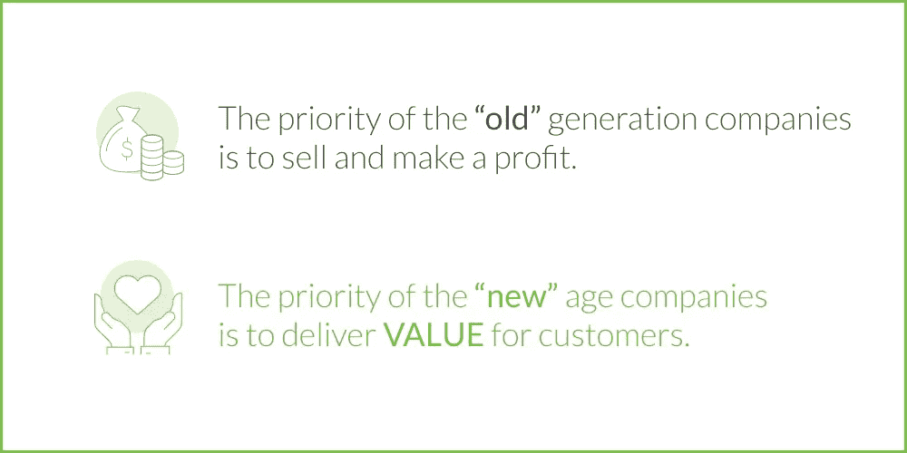

# 为什么你应该摆脱“营销思维”，以及它如何破坏向数字时代的过渡

> 原文：<https://medium.com/swlh/why-you-should-get-rid-of-a-marketing-mindset-and-how-it-ruins-the-transition-to-the-digital-age-7495de346cab>

## 我之前的一篇关于从“营销思维”过渡到“体验思维”的文章引起了争议。有人甚至称之为“数字商业宣言”无论如何，我不会假装教授数字时代正确的商业方法。我的目的是强调向客户提供服务和以“新方式”思考与“旧方式”思考之间的区别。这些差异可以解释为什么一些产品在现代数字环境中成功，而另一些却不成功。

*由 Alex Kreger 发布，金融 UX 战略家/UX 设计机构**的创始人*

*正如我在上面指出的，以一种非常实际的方式，这篇文章展示了影响金融商业文化的思维差异。此外，在本文中，您将找到在发表[“什么将定义银行业的客户体验:激励您做出改变的五种趋势”后出现的一些问题的答案](https://www.uxdesignagency.com/blog/what-will-define-banking-in-the-future-5-trends-that-will-motivate-you)*

# *相反的文化*

*让我们从提供金融服务的两种相反类型的公司开始考虑:*

## *公司 A*

*第一个目标是尽一切可能增加利润。为了做到这一点，公司评估每一个行动，以最大限度地提高利润和降低成本。一方面，它取消了供应商的折扣，降低了员工成本。从另一方面来说，该公司通过向销售代理所能接触到的每一个活生生的人推销产品来尽一切努力增加销售额。销售人员的目标定得如此之高，以至于他们准备使用任何一种论点来确保销售。*

**

*这家公司的整个战略是严格安排的，他们的主要目标是为股东获得最大收益。因此，任何行动都要根据潜在回报和风险进行评估。而且，在造成损失的情况下，有罪者会受到严厉的惩罚。这就是为什么员工害怕承担责任，宁愿把责任推给昂贵的顾问。最终，人们担心他们的职位，部门担心他们的预算。*

*这样的公司认为世界是危险的……竞争的。高管们将商业视为一场战争。狡猾和力量是从世界上赢得一块蛋糕所需要的素质。但是，在他们这样做之后，他们需要更多的努力来保护它。每个人都为自己，所有的行动都是保密的。因此，沟通和决策的速度变慢了，所以开发要拖上好几年。不幸的是，顾客常常成为这场战争的筹码。*

## *B 公司*

*然而，也有相反类型的公司——这种公司将世界视为充满潜在朋友的机会空间，公司希望向这些朋友提供帮助和一些好处。*

*他们不关注自己，而是渴望为世界创造价值，从而让世界变得更好。这并不意味着这样的公司不在乎利润。对他们来说，利润是一种重要的资源，可以增加创造的价值。但是，利润不是存在的意义；这仅仅是与创造的利益水平成正比的结果。*

**

*这样的公司在活动中非常有选择性；它做任何工作都不是为了钱。相反，它专注于长期战略，经常拒绝不道德的提议，尽管这些提议有利可图。*

*这家公司没有把员工视为成本，而是视为卓越客户服务的提供者。管理层不仅欢迎和鼓励员工的主动性，而且认为这是发展的唯一途径。这就是为什么没有人害怕承担责任，表现出主动性。错误有时会发生，但会被仔细研究，以提高公司的适应性。一切都是为了提高和发挥员工的潜力。*

*没有多层次的等级制度或内部权力斗争，因为员工团结在公司的使命周围，他们坚信这一点。此外，还有一个质量部门来改善客户体验，而不是一个直销部门。*

*公开讨论行动，快速做出决策。在这里，一切都受到质疑，以寻求更有效的解决方案。取代保护的是开放、灵活和寻找旨在为客户增加价值的增长点。*

# *你会选择哪家公司？*

*你怎么想呢?这些公司中哪一个更有可能在现代社会取得成功？从数字时代的角度来看，哪一种更具适应性和有效性？哪个能够赢得消费者的心，在社交网络上获得最有力的支持？哪一个会在技术飞速发展带来的巨变中生存下来？谁的员工会为了自己的公司赴汤蹈火？*

*这些公司在战略、运作方式和优先事项上截然相反。第一类公司的大量出现是由工业时代的市场条件造成的。这是一种符合当时要求的真实的商业形式，我们认为这种方式是由“营销思维”造成的。*

> *向数字技术的结构性转变从根本上扰乱了市场、用户行为以及相应的业务需求。在数字时代的成功公司中，我们看到基于“体验思维”的截然相反的价值观和文化。*

*但是，第一种类型的公司是否有可能通过实施敏捷、CX、UX、设计思维等，简单地复制新世纪公司的运作方式，从而进入下一个层次呢？？面对这些公司的产品，我们经常会看到表面上的改进并没有带来客户服务质量的提高。他们仍然追求利润而不是客户满意度。成功的数字化转型需要组织心态的文化转变。*

> *我们认为，转变这样一家公司并使其进入数字时代的唯一途径是改变思维方式和价值观。这需要整个公司实施一种新的方式来感知世界和公司在其中的位置。*

*如何做到这一点？我们将进一步讨论。*

# *营销有什么问题？*

*清楚地理解我们所说的“营销”作为一种思维方式的含义是非常重要的。因为这里我们讨论的是两种心态的差异，这两种心态与术语“营销”或“客户体验”没有直接联系我们不想在这种情况下用“营销”这个词来混淆人们。实际上，你可以把这种上世纪的思维方式贴上“利润”、“广告”、“包装”或者其他的标签，因为这不是命名的问题，而是差异背后的意义。*

*问题是，我们相信现代世纪不再是营销的世纪。“营销”一词是从它的原意演变而来的，字面意思是带着商品去市场销售。这意味着一种直接的思考和感知事物的方式，这是上一个时代作为工业革命的结果而建立起来的。总的来说，它有助于刺激十亿类似快速消费品的消费。*

*刚开始的时候，竞争还不强，简单的通过媒体告知消费者自己的产品就够了。日益激烈的竞争催生了定位、品牌本质和独特销售方案等技巧，这些技巧是探索特定产品的差异和优势所必需的。但是，现实生活中，两种洗衣粉没那么大区别吧？他们只是将一些颗粒染成蓝色，并声称效果更好。*

*大多数市场研究并不试图发现对新产品的需求，而是寻找提高现有产品销量的诱因。为什么？因为这是以利润为导向的简单商业思维，在前一个时代非常有效。*

> *问题是，在数字时代，这种方法已经行不通了。由于消费价值观的变化，商业模式发生了结构性转变。由于数字环境，消费者改变了他们的行为和决策过程，企业也应该通过改变价值观来适应数字环境。我们已经看到传统公司和数字公司在资本总额上的巨大差异。*

# *简单地*

**

*这并不意味着利润对“新时代”的公司来说是不重要的。他们不同于“老顾客”,他们从向朋友推荐产品的满意顾客身上获利。*

> *这种战略建立的是信任和长期成功，而不是通过积极营销低质量无用产品赚来的快钱。*

*我们认为，为了让产品取得长期成功，它必须:*

1.  *格外有用；*
2.  *对客户有价值；*
3.  *使用舒适且有吸引力。*

*这是一个受高管心态影响的优先顺序问题。对于传统公司来说，体验工具只是其营销的一部分。对他们来说，重要的是推动销售，探索触发因素，设计一个有吸引力的包装来盈利。对于新时代的公司来说，营销只是他们体验战略中的一个工具——一种确保客户价值最大化并获得利润作为回报的方式。*

*你最优先考虑的是什么？*

*了解更多关于金融业成功心态的信息:*

*阅读更多关于金融设计的信息:*

*[2019 年的银行业应该是什么样子:10 个最令人耳目一新的银行和金融科技 UI/UX 设计的集合](https://www.uxdesignagency.com/blog/what-banking-should-look-like-a-collection-of-10-most-interesting-financial-ui-ux-designs)*

*[UX 设计指南:如何打造世界上最美的手机银行](https://www.uxdesignagency.com/blog/ux-design-case-study-most-beautiful-banking-in-the-world)*

*[银行通过设计思维取得成功必须克服的主要障碍](https://www.uxdesignagency.com/blog/Key-Obstacles-Banks-Must-Overcome-to-Succeed-Through-Design-Thinking)*

**

## *这篇文章发表在 [The Startup](https://medium.com/swlh) 上，这是 Medium 最大的创业刊物，拥有+437，678 名读者。*

## *在这里订阅接收[我们的头条新闻](https://growthsupply.com/the-startup-newsletter/)。*

**