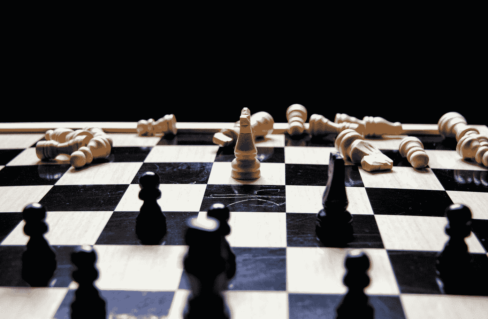

# 为什么你应该学会失败

> 原文：<https://medium.com/swlh/why-you-should-learn-to-lose-36a36d5ba2b7>

## 我是个讨厌的失败者。有一段时间，我甚至告诉自己，我根本不是一个失败者。当然，这完全是胡说八道。

Photo by [Louis Hansel](https://unsplash.com/@louishansel?utm_source=medium&utm_medium=referral) on [Unsplash](https://unsplash.com?utm_source=medium&utm_medium=referral)

## 每个人在一生中的某个时刻都是失败者

有些更频繁，有些更少。但是给我看一个从未在他的人生中接受失败的人…