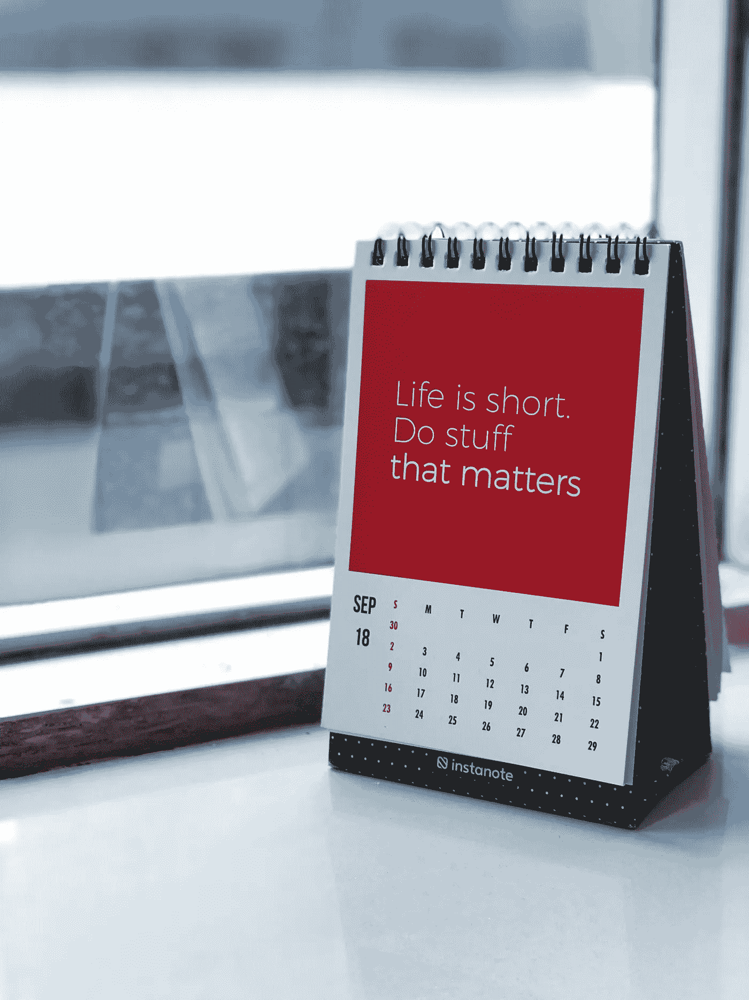

# 为什么你要像不能拥有一切一样过好每一天

> 原文：<https://medium.com/swlh/why-you-should-live-every-day-like-you-cant-have-it-all-186658f829e2>

Photo by [Manasvita S](https://unsplash.com/@manasvita?utm_source=unsplash&utm_medium=referral&utm_content=creditCopyText) on [Unsplash](https://unsplash.com/search/photos/motivation?utm_source=unsplash&utm_medium=referral&utm_content=creditCopyText)

> “几百年后，当我们这个时代的历史将从长远角度书写时，历史学家看到的最重要的事件很可能不是技术，不是互联网，也不是电子商务。这是人类状况前所未有的变化。第一次——真的——越来越多的人有了选择。第一次，他们…