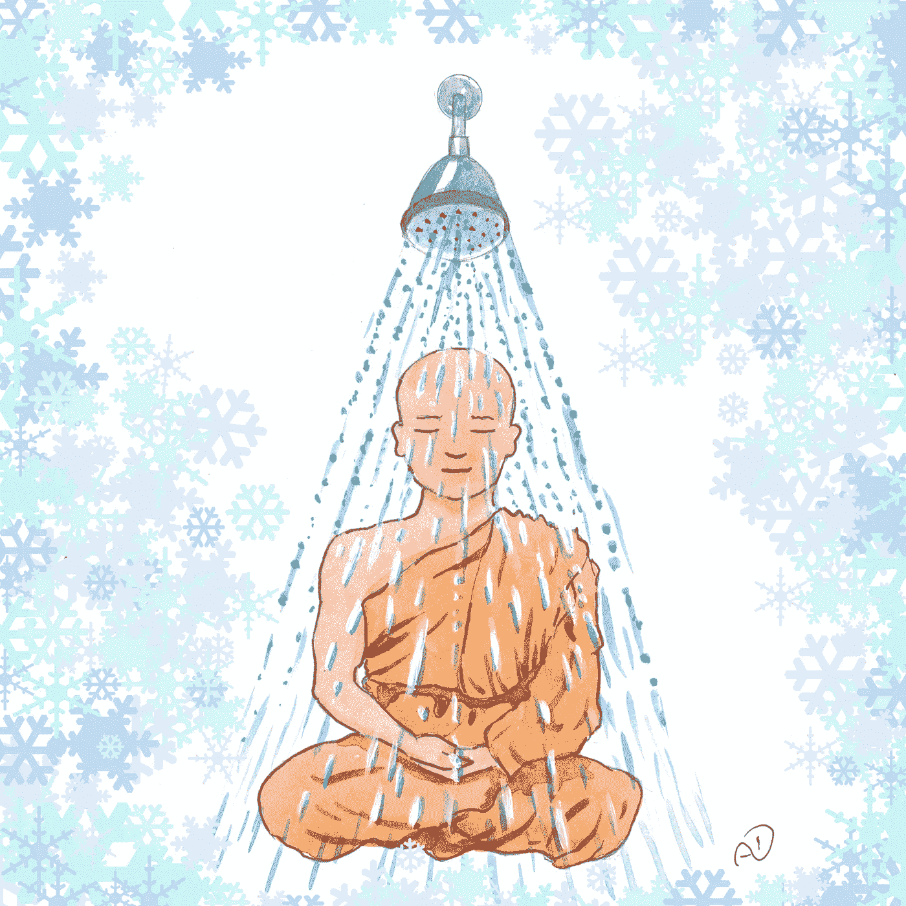

# 为什么洗完冷水澡后要冥想

> 原文：<https://medium.com/swlh/why-you-should-meditate-after-a-cold-shower-a81aa549772b>

## 早晨的最佳组合

Illustration by yours truly

旧淋浴和冥想是自我提升社区中被强烈推荐的两个习惯。主要是因为它们的好处似乎无穷无尽。它们包括:减少压力，提高免疫功能，更清晰的焦点和更好的整体健康。然而，由于不同的原因，两者都很难灌输。一开始，很冷…