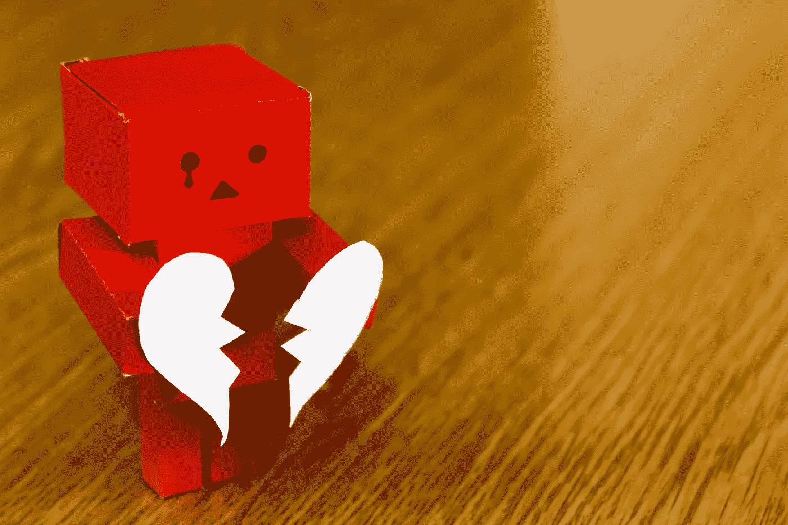

# 为什么你永远不应该害怕被拒绝

> 原文：<https://medium.com/swlh/why-you-should-never-fear-rejection-35f95ca595d9>

Photo by burak kostak on Pexels

人类天生害怕被拒绝。拒绝是痛苦的，无论是在校园里，在工作面试中，被潜在的合作伙伴，甚至是被拒绝你的作品的出版物。所以我们通过完全不尝试来避免它。

为了避免被火刷到，我们完全远离厨房。在校园里，我们张口结舌地站着，害怕带着这个牌子接近受欢迎的孩子们…