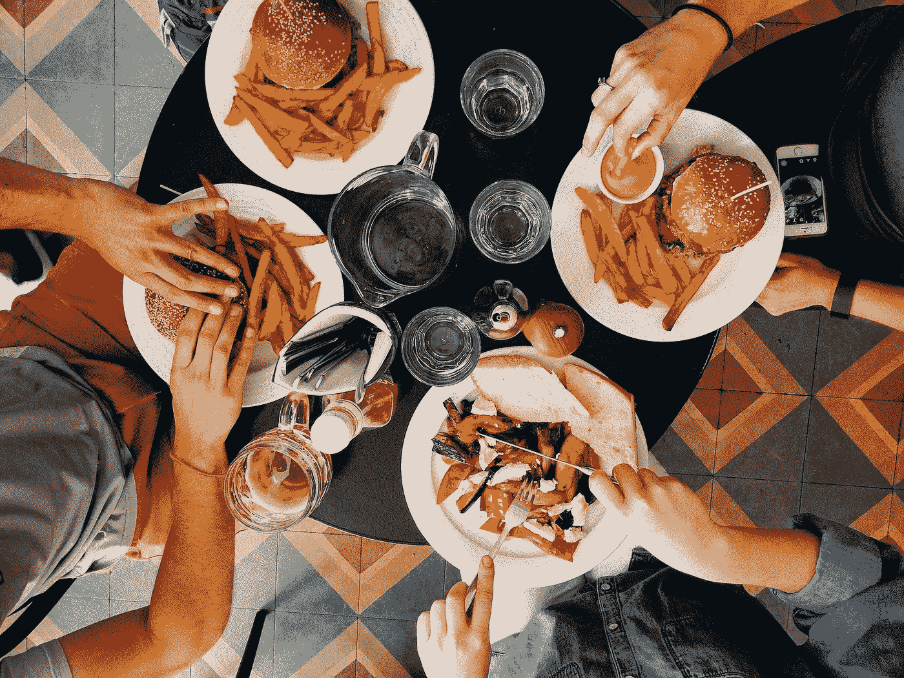

# 为什么你不应该独自吃午餐

> 原文：<https://medium.com/swlh/why-you-should-never-lunch-alone-cdd36b6ec018>

Originally published on [**JOTFORM.COM**](https://www.jotform.com/blog/never-lunch-alone/)

拿上你的护照。让我们来看看世界各地的典型午餐。

第一站:圣保罗，下午 1 点来到这里，[巴西人](https://theculturetrip.com/south-america/brazil/articles/how-to-eat-and-drink-like-a-local-in-brazil/)涌入餐馆，享用长达一小时的午餐，可能会以一小口酒开始(以增进食欲)，以一杯浓浓的含糖浓咖啡结束。

接下来是奥斯陆，在那里[的挪威人](https://www.thedailymeal.com/travel/what-office-lunches-look-around-world-slideshow/slide-8)很少离开办公室，而是享受自制的 SMR brd——一种开放式的…