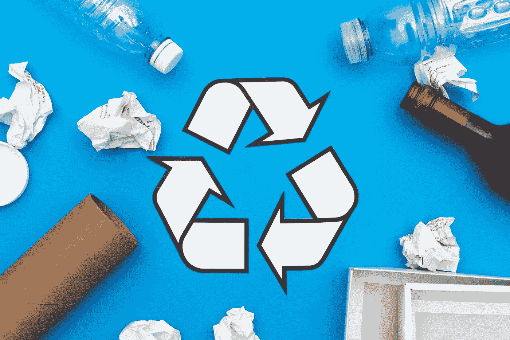

# 为什么你应该循环利用你的故事

> 原文：<https://medium.com/swlh/why-you-should-recycle-your-stories-1faafd462f71>

Photo by [Shopify Partners](https://burst.shopify.com/@shopifypartners?utm_campaign=photo_credit&utm_content=Picture+of+Recycle+Symbol+And+Items+%E2%80%94+Free+Stock+Photo&utm_medium=referral&utm_source=credit) from [Burst](https://burst.shopify.com/recycling?utm_campaign=photo_credit&utm_content=Picture+of+Recycle+Symbol+And+Items+%E2%80%94+Free+Stock+Photo&utm_medium=referral&utm_source=credit)

## 你发表的所有故事都值得一读。

每个写作和出版的人都写过一些没有得到预期关注的东西。无论是因为最初看到内容的人很少，还是因为它缺乏质量。没有人读它。